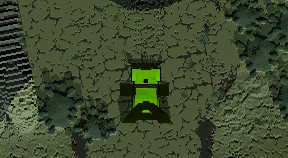
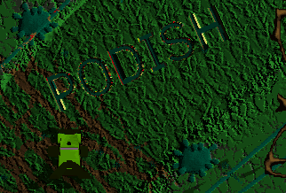

# Vange-rs
[](https://travis-ci.org/kvark/vange-rs)
[](https://gitter.im/vange-rs/Lobby?utm_source=badge&utm_medium=badge&utm_campaign=pr-badge)

[Vangers](https://www.gog.com/game/vangers) is a legendary game featuring unique gameplay and technical innovation.
The idea of this project is to replicate the old look and behavior, but with native hardware acceleration for the graphics.

You need the **original game** in order to try out `vange-rs`. The path to resources needs to be set in `config/settings.ron`.

## Instructions

The project is structured to provide multiple binaries. `road` binary is for the main game, which includes mechouses, items, and the level.
Note: leaving the `level=""` empty in the config would load a flat boring debug level.

```bash
git clone https://github.com/kvark/vange-rs
cd vange-rs
cp config/settings.template.ron config/settings.ron
vi config/settings.ron # set the game path
cargo run --bin road
```
Controls:
  - `WSAD`: movement in the game, rotating the camera around the car during the pause
  - `P`: enter/exit pause for debugging
  - `R`: reset forces and orientation of the mechous
  - `<>`: step physics frame back/forward during the pause
  - `Esc`: exit


### Mechous viewer/debugger
`car` binary allows to see the mechos with items selected by the configuration. It also shows the debug collision info.
```bash
cargo run --bin car
```
Controls:
  - `WSAD`: rotate the camera
  - `Esc`: exit


### 3D model viewer
`model` binary loads a selected "m3d" from games resource to observe.
```bash
cargo run --bin model resource/m3d/items/i21.m3d
```
Controls:
  - `AD`: rotate the camera
  - `Esc`: exit


### Level viewer
`level` binary allows to fly over a level with free camera. Useful for debugging the level rendering shader.
```bash
cargo run --bin level
```
Controls:
  - `WSAD`: move the camera along X-Y plane
  - `ZX`: move the camera along Z plane
  - `Alt` + `WSAD`: rotate the camera
  - `Esc`: exit


### Converter
`convert` binary is a command line utility for converting the game data into formats that are more interoperable. Basically you provide 2 arguments as fully-qualified file names (can be relative, but relative to the current directory - the settings paths are not used here), and the converter figures out the way to convert one into another. Note that only part after "--" makes sense when running a standalone binary.

Note: the destination path is always to a file that gets created or overwritten!

#### Model (M3D) <-> OBJ+RON
```bash
cargo run --bin convert -- game/resource/m3d/items/i21.m3d my_dir/model.ron
```
The body, wheels, and debris are saved as separate Wavefront OBJ files near the target [RON](https://github.com/ron-rs/ron), which contains model meta-data.

You can change the OBJ files using popular mesh editors, save them, and even manually tweak RON, after which you may want to generate a new M3D file:
```bash
cargo run --bin convert -- my_dir/model.ron game/resource/m3d/items/i21-new.m3d
```



#### Level(INI+VMC/VMP) <-> PNG+RON
```bash
cargo run --bin convert -- game/thechain/fostral/world.ini my_dir/fostral.ron
```

The RON file contains the size and names of two images: heights and materials. The former conains the following data:
  - R stands for the bottom layer height
  - G stands for the top layer height
  - B stands for the delta between the bottom and the ground above

The materials image only uses two channels:
  - R contains the index of the bottom layer material in its higher 4 bits. The lower 4 bits are ignored.
  - G contains the index of the top layer

You can change the images in a photo editor, and then we can import it as a non-compressed level:
```bash
cargo run --bin convert -- my_dir/fostral.ron game/thechain/fostral/output.vmp
```



Note: one can easily turn a non-compressed level file (VMP) into a pseudo-compressed one (VMC) by prepending the unzipped `etc/vmc-header.zip` file.

#### PAL <-> PNG

Palette files are really simple one-dimensional arrays of 256 colors. They ca be converted to PNG with the following command:
```bash
cargo run --bin convert -- game/thechain/fostral/harmony.pal my_dir/harmony.png
```
The image can be edited and then converted back to a palette:
```bash
cargo run --bin convert -- my_dir/harmony.png my_dir/harmony-new.pal
```

## Technonolgy

The game uses [gfx-rs pre-LL](https://github.com/gfx-rs/gfx/tree/pre-ll) for graphics and [glutin](https://github.com/tomaka/glutin) for context creation.

The level is drawn in a single full-screen draw call with a bit of ray tracing magic. There is also an experimental tessellation-based renderer, but neither produce results of sufficient quality.
