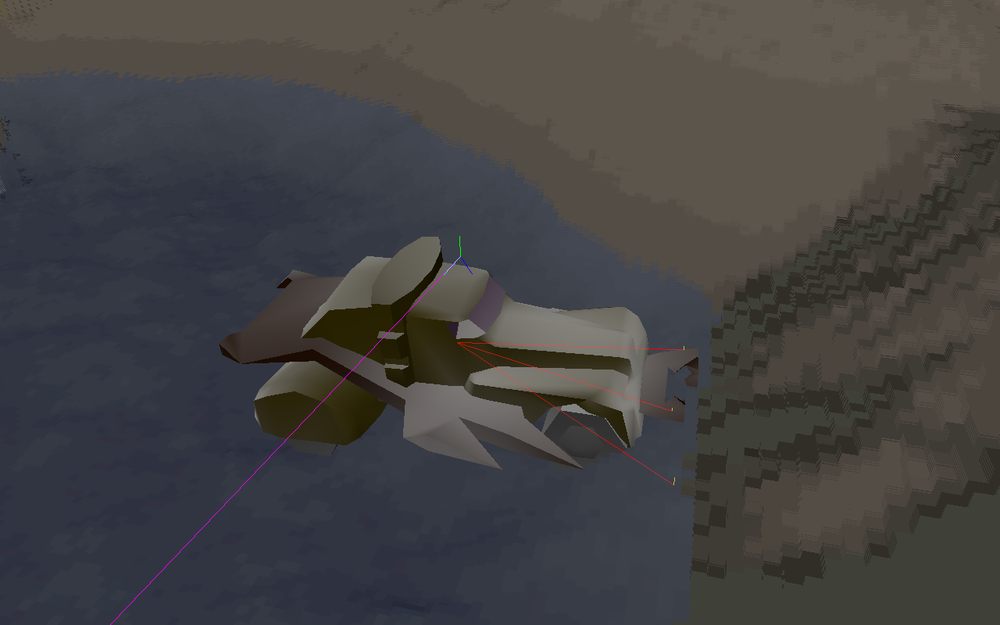
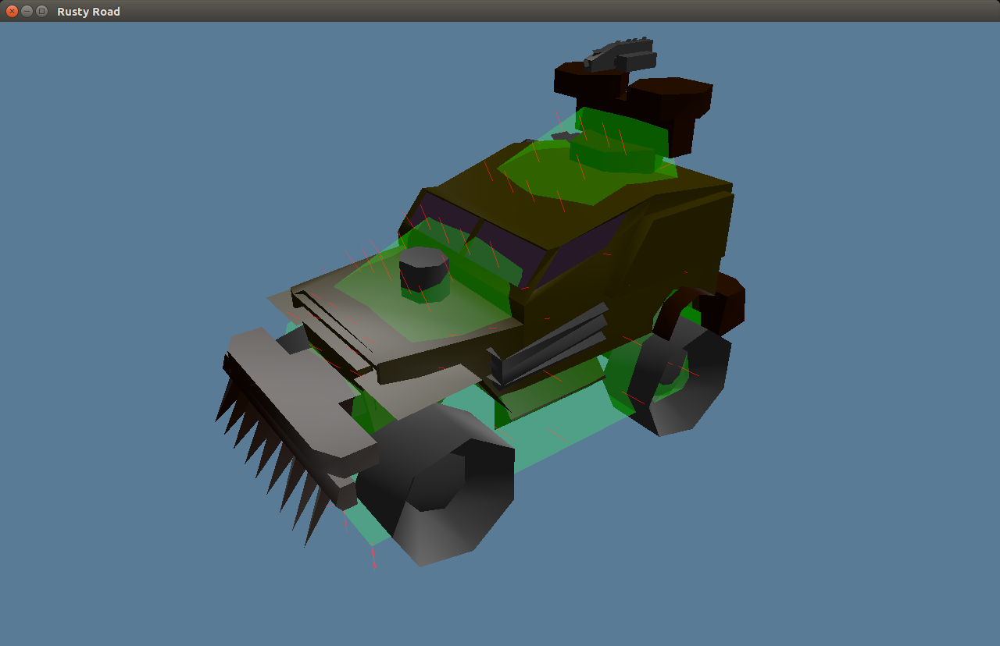
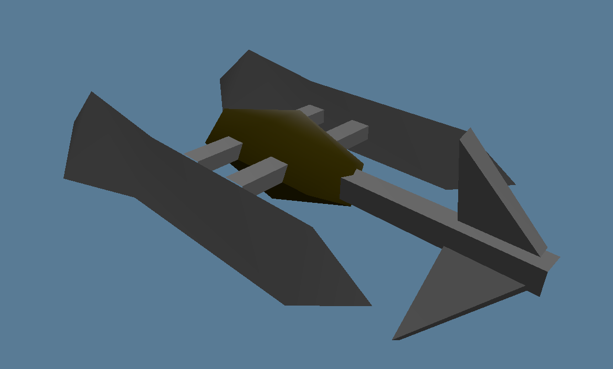

# Vange-rs

[](https://gitter.im/vange-rs/Lobby?utm_source=badge&utm_medium=badge&utm_campaign=pr-badge)

[Vangers](https://www.gog.com/game/vangers) is a legendary game featuring unique gameplay and technical innovation.
The idea of this project is to replicate the old look and behavior, but with native hardware acceleration for the graphics.

You need the **original game** in order to try out `vange-rs`. The path to resources needs to be set in `config/settings.ron`.


## Technology

The game uses [wgpu-rs](https://github.com/gfx-rs/wgpu-rs) for graphics and [winit](https://github.com/tomaka/winit) for windowing.

The level is drawn in a single full-screen draw call with a bit of ray tracing magic. There is also an experimental tessellation-based renderer, but neither produce results of sufficient quality. See the [dedicated wiki page](https://github.com/kvark/vange-rs/wiki/Rendering-Techniques) for our rendering technologies.

## Instructions

The project is structured to provide multiple binaries. `road` binary is for the main game, which includes mechouses, items, and the level. You can find the binaries produced automatically in the [releases](https://github.com/kvark/vange-rs/releases).


```bash
git clone https://github.com/kvark/vange-rs
cd vange-rs
cp config/settings.template.ron config/settings.ron
edit config/settings.ron # set the game path
cargo run
```

Note: leaving the `level=""` empty in the config would load a flat boring debug level.

Note: with `backend="Auto"` the engine tries the available backends in this order: Metal, Vulkan, DX12.

Controls:
  - `WSAD`: movement in the game, rotating the camera around the car during the pause
  - left shift: turbo
  - `P`: enter/exit pause for debugging
  - `R`: reset forces and orientation of the mechous
  - `<>`: step physics frame back/forward during the pause
  - `Esc`: exit



### Mechous viewer/debugger
`car` binary allows to see the mechos with items selected by the configuration. It also shows the debug collision info.
```bash
cargo run --bin car
```
Controls:
  - `WSAD`: rotate the camera
  - `Esc`: exit



### 3D model viewer
`model` binary loads a selected "m3d" from games resource to observe.
```bash
cargo run --bin model resource/m3d/items/i21.m3d
```
Controls:
  - `AD`: rotate the camera
  - `Esc`: exit



### Level viewer
`level` binary allows to fly over a level with free camera. Useful for debugging the level rendering shader.
```bash
cargo run --bin level
cargo run --bin level -- resource/iscreen/ldata/l0/escave.ini # load menu
```
Controls:
  - `WSAD`: move the camera along X-Y plane
  - `ZX`: move the camera along Z plane
  - `Alt` + `WSAD`: rotate the camera
  - `Esc`: exit


### Converter
`convert` binary is a command line utility for converting the game data into formats that are more interoperable. Please see the [wiki page](https://github.com/kvark/vange-rs/wiki/Resource-Converter) for the usage instructions.
