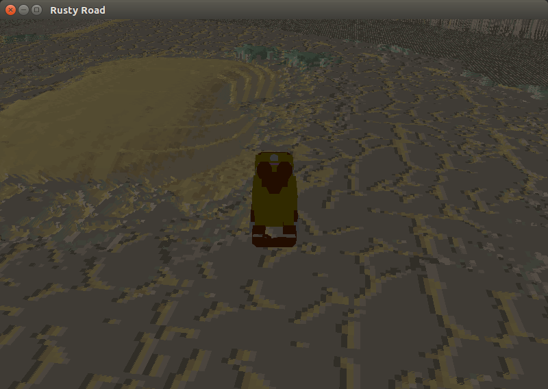

[Vangers](https://www.gog.com/game/vangers) is a legendary game featuring unique gameplay and technical innovation.
The idea of this project is to replicate the old look and behavior, but with native hardware acceleration for the graphics.

You need the **original game** in order to try out `vange-rs`. The path to resources needs to be set in `config/settings.toml`.

### Instructions
```bash
git clone https://github.com/kvark/vange-rs
cd vange-rs
vi config/settings.toml # set the game path
cargo run --release
```

### Latest progress


