# Six Ways to Draw Vangers with WebGPU: Real-Time Rendering of Editable Multi-Layer Height Fields

**Dzmitry Malyshau**<br>
Independent Researcher<br>
<kvark@fastmail.com><br>
ORCID [0009-0005-6410-4276](https://orcid.org/0009-0005-6410-4276)

**Submitted to the Journal of Computer Graphics Techniques.**

The six selected configurations are RayTraced 128, RayVoxel 100, Sliced 512,
Scattered 4,4,4, Painted, and Mesh q=0.5. Quality, timing, preparation,
and edit numbers are from one five-device batch at those settings.
Fostral world data is CC BY-SA 4.0 from Association K-D Lab.

---

## Abstract

Terrain level-of-detail is measured almost exclusively on digital
elevation models: single-valued, smooth at the sampling scale, sampled
from real topography. Game terrain is often none of these. We compare six
rendering methods — height-field ray marching, voxel-accelerated ray
marching, sliced proxy geometry, per-sample bar rasterization, compute
scattering, and a fitted triangle mesh — implemented in a single engine
over a single data path, on the hand-authored multi-layer terrain of
*Vangers* (1998), scored against a CPU ray cast of the same source data.
Every method must preserve the two solid intervals available at a ground
sample, render at interactive rates, and reflect local terrain destruction
without reloading the level. These constraints rule out treating caves as
decoration or amortising a static preprocessing step over an immutable map.

From the original game's top-down camera the six methods look interchangeable.
At eye-level horizons they do not: point scattering loses coverage, slicing
bands, and an over-simplified mesh can miss a wall. At the selected quality
settings a greedy triangulated irregular network (TIN) has the lowest mean
frame time on every device we measured, but the fit cost is set by the second
layer rather than by floor relief, and making that mesh editable retains
319 MiB of GPU geometry and 535 MiB of CPU triangulation. All six
implementations use the same native wgpu / WebGPU API and canonical WGSL.
We release the engine, the harness, and a one-command measurement protocol.

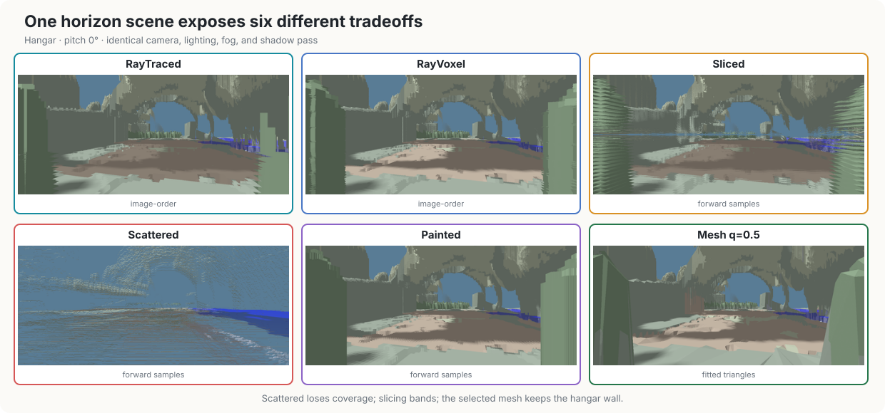

## 1. Introduction

Terrain rendering research usually starts with a digital elevation model:
a single-valued surface whose resolution can be traded against screen-space
error. Authored game terrain can violate each part of that model. It may be
quantised, intentionally discontinuous, and multi-layered, and it is judged
from cameras that the original authoring tool never showed. Those
differences make familiar reduction ratios and quality settings poor
predictors until they are measured on the actual data.

The historical baseline deserves emphasis. Almost three decades ago,
*Vangers* rendered this destructible, multi-layer world in software on consumer
CPUs while fitting the game and its streamed terrain into a 16 MB-era memory
budget [K-D Lab / KranX]. It succeeded by co-designing the
encoding, renderer, and modestly angled oblique top-down views. Its software
renderer used a painter's algorithm, traversing terrain line by line from back
to front; that object-order projection later inspired the Scattered method
(§3.5). The distance since then is simultaneously large and small: modern
GPUs make arbitrary cameras, common shadowing, and portable programmable
shading practical, yet the horizon and cave cases below still punish a
representation that is not matched to the data.

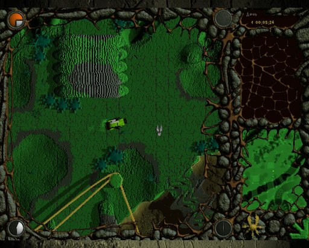

This study has three non-negotiable system constraints. First, the renderer
must preserve multiple vertical solid intervals, including the underside of
an upper slab. Second, it must run inside an interactive frame budget rather
than produce an offline conversion. Third, a bounded edit to height and layer
metadata must become visible without a level reload or a full rebuild. The
last constraint is inherited from the 1998 engine: deformation and terrain
destruction are gameplay operations, not authoring-time exceptions; the source
release is the primary implementation record [K-D Lab / KranX]. We report
frame latency rather than assigning a hardware-independent meaning to
"real-time", and separate steady-state rendering from post-edit maintenance.

### 1.1 Related work and scope

The closest published representation is not a conventional height field.
Benes and Forsbach [2001] store a 2D grid of vertical material intervals and
edit it with erosion; this is the same broad height-column/voxel compromise as
the shipped Vangers data, though with variable geological strata rather than
a fixed pair of solids. Their visualization converts the data to height fields
or triangles and does not preserve caves interactively. Grounded Heightmap
Trees [Alonso and Joan-Arinyo 2008] go further by attaching locally oriented
height maps to represent overhangs, tunnels, and large editing events. They are
more general than the fixed vertical Vangers encoding but require a changing
tree of local parameterizations. QuadStack [Graciano et al. 2021] is the
closest direct-rendering system: it run-length encodes vertical stacks,
compresses coherent neighbours in a quadtree, and ray casts the compressed
layers on the GPU. Its published construction and evaluation target compressed
volumes and provide no local edit algorithm; modifying a compressed region can
require recalculating the representation. Our source is already compact and
gameplay edits are required, so we retain direct random access and update only
method-specific dirty regions.

Layered Depth Images also store several samples along a ray [Shade et al.
1998], but those samples belong to one input camera and are splatted into
nearby views. Vangers layers instead live in world-space vertical columns;
they survive arbitrary camera motion and are the editable simulation state.
The similarity is therefore depth complexity, not representation semantics.

The rendering families themselves are established. Relief mapping uses a
linear search followed by refinement through a single height texture
[Policarpo et al. 2005], and GPU landscape ray casting makes the cost
output-sensitive [Mantler and Jeschke 2006]. Maximum mipmaps add conservative
hierarchical skipping while remaining cheap enough to update for dynamic,
single-valued height fields [Tevs et al. 2008]. Our first marcher keeps the
linear/refinement structure but evaluates two solid intervals; our voxel path
generalises the hierarchy to 3D occupancy so it can skip empty caves as well
as air. This is deliberately simpler and more updateable than a compressed
sparse voxel scene [Laine and Karras 2010].

The three forward methods likewise have clear precedents. Texture-based
volume rendering accumulates view-aligned slices [Cabral et al. 1994], while
volume and surface splatting spread each sample over a reconstruction
footprint [Westover 1990; Zwicker et al. 2001]. Our slicer uses horizontal
planes because membership in a vertical interval is then a direct texture
test; the resulting grazing-angle bands are the price. Our scatterer writes
one nearest-depth pixel per sample rather than a filtered footprint, which
explains its holes and temporal speckle. A multi-pixel splat is promising,
but it also multiplies contended atomic writes and is left as a measured
follow-up rather than folded into this comparison without tuning.

Finally, triangulated irregular network (TIN) fitting and terrain LOD
provide the mesh lineage [Fowler and Little 1979; Garland and Heckbert 1995;
Duchaineau et al. 1997; Losasso and Hoppe 2004]. Those systems approximate a
single-valued surface. Our mesh
shares one topology across three discontinuous altitude fields and locally
refits dirty chunks after edits, which is the source of both its unusual fit
cost and its update burden.

The implementations in this repository were developed from first principles
before this literature audit. That history is not an algorithmic priority
claim. The contribution is the controlled comparison under the three
constraints above, plus the resulting failure analysis, rather than a claim
that ray marching, interval terrain, splatting, slicing, voxels, or greedy
TINs are new.

Contributions:

1. A controlled comparison of six terrain rendering methods sharing one
   engine, one data path, one camera and one fragment-stage shading
   path, so differences are attributable to the method rather than the
   surrounding system.
2. An evaluation methodology scoring against a CPU ray cast of the source
   data, decomposed into coverage, geometric and coherence error, with
   the failure mode of the naive version documented.
3. The engine, the harness and the measurement protocol, released under
   a permissive license (see *Data availability* below).
4. A ten-world survey isolating what actually drives fit cost, and the
   mechanism behind it.
5. An edit-path audit showing which methods consume the live interval field
   directly and which must maintain derived acceleration or mesh data.
6. A five-device portability check across Vulkan and Metal using the same
   validated WGSL shaders and renderer configuration.

### 1.2 A decade-long WebGPU testbed

This comparison is also the record of a long-running implementation, not six
algorithms written for one benchmark. vange-rs began in June 2016 and passed
its tenth anniversary while this study was being prepared. The basic ray path
dates to that first month; the move to the pre-release native wgpu stack and
the sliced and scattered paths followed in 2019, Painted in 2020, the complete
WGSL migration in 2021, RayVoxel in 2022, and the current fitted mesh in 2026.
The techniques therefore accumulated gradually as the engine, API, shader
language, and available hardware matured.

The comparison vehicle is the *native* WebGPU API as implemented by wgpu:
one validated WGSL source, no backend-specific shaders, no unchecked native
commands. Firefox uses wgpu-core to validate WebGPU operations and route
them through native graphics APIs, while Naga validates and translates WGSL
[Malyshau 2020; gfx-rs; W3C WebGPU; W3C WGSL]. vange-rs moved to wgpu 0.2
in March 2019 and migrated all terrain, object, and debug shaders to WGSL
in 2021 [Malyshau 2021]. The same source can be compiled to the web; that
is a path-to-the-web proof, not a second evaluation. The numbers in this
paper are native Vulkan and Metal runs of that API.

No method bypasses the stack. The comparison therefore asks what quality
and performance these unusual terrain techniques achieve *inside* WebGPU's
portable, validated programming model, rather than how far one backend can
be special-cased. Agreement of the five result grids across four Vulkan
adapters and Apple Metal is the direct portability result; timing remains
backend- and device-specific, and §5.2 keeps unlike timing mechanisms
separate.

A browser smoke test builds the same source for `wasm32-unknown-unknown`
and runs the WebGPU-only voxel route in Firefox 152. On a Radeon 890M,
Firefox selected its Vulkan WebGPU backend, accepted the canonical WGSL,
loaded Fostral, and rendered a 1280×714 canvas. This establishes that a
web path exists and looks right; it is not a browser performance result.
Commands, versions, and artifact hashes are in `paper/browser-smoke.md`.

**Data availability.** The engine and evaluation tools are Apache-2.0. The
five-device publication batch is pinned at
[`terrain-paper`](https://github.com/kvark/vange-rs/tree/terrain-paper).
Fostral world data is published by Association K-D Lab under
[CC BY-SA 4.0](https://creativecommons.org/licenses/by-sa/4.0/); the
canonical tree is
[`KranX/Vangers` `data/thechain/fostral`](https://github.com/KranX/Vangers/tree/master/data/thechain/fostral)
at commit `f1ad7d7`. The harness fetches that commit; we do not redistribute
a second archive. The ten-world fit survey also uses nine other shipped
levels that are not in that grant — those rows require a lawfully obtained
game copy. Derived figures and the supplemental video use Fostral and carry
the same attribution.

## 2. The Data

Vangers terrain is a height map with a per-texel-*pair* dual encoding.
A texel is either single-valued, or carries three altitudes: a floor
(`low`), a cave ceiling (`mid`) and a slab top (`high`), with the even
texel of a pair storing `low`, the odd one `high`, and `mid` derived from
delta bits in both. Fostral, the level used throughout, is 2048×16384 and
10.9% double-level.

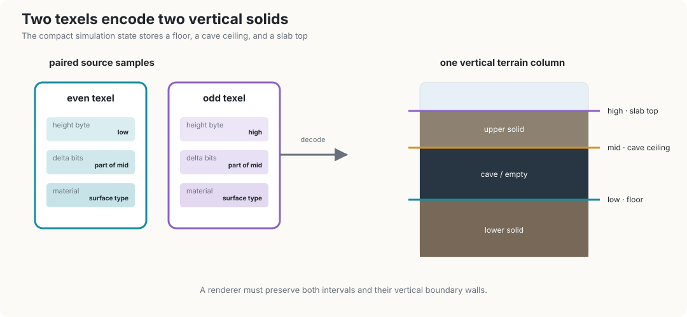

Two properties matter for everything that follows. The surface is
**authored, not sampled**: cliffs are vertical by construction rather than
by steep gradient, and adjacent texels routinely differ by tens of units.
And `mid`/`high` are **structural, not fields**: they describe where a
slab is, and interpolating them across the region boundary produces
geometry that exists nowhere. Section 6.3 is about what that costs.

The height and metadata arrays are also mutable simulation state. A local
gameplay event may change both altitude and whether the upper interval exists.
The renderer receives a dirty rectangle, uploads the modified rows, and must
make that edit visible. Ray, Sliced, Painted, and Scattered read the updated
texture directly. RayVoxel incrementally rebuilds affected occupancy cells and
their ancestors; Mesh locally refines affected chunks and replaces their GPU
buffers. Thus all six support edits, but their time-to-consistency and update
cost are different quantities that steady-state frame time does not capture.
§5.4 shows the same crater before and after on a direct reader, an
incremental occupancy rebuild, and a local mesh refit, and reports both
CPU submit-and-wait and GPU draw cost for the first updated frame.

## 3. Methods Compared

All methods use the same decoded height and material data, camera, palette,
fog, diffuse-lighting function, and shadow map. The method under test is the
way visible surface samples reach the framebuffer. The mesh alone supplies
a geometric normal; the other five estimate a height-field gradient in the
shared shading function.

Scattered stores 24 bits of depth and 8 bits of terrain type in its
intermediate buffer, then reconstructs world position and applies the same
diffuse and shadow evaluation in its resolve pass as the other five methods.

The methods fall into three groups. The two image-order methods cast one ray
per pixel. Sliced, Painted, and Scattered enumerate samples of the encoded
volume and project them forward. Mesh performs an offline fit and rasterizes
the resulting explicit surface.

| method | order | primitive | edit response |
|---|---|---|---|
| Height-field ray march | image | per-pixel ray | direct texture read |
| Voxel-accelerated ray march | image | per-pixel ray | incremental occupancy rebuild |
| Sliced | object | horizontal proxy quads | direct texture read |
| Painted | object | bars per ground sample | direct texture read |
| Scattered | object | compute-scattered points | direct texture read |
| **Mesh (TIN)** | object | fitted triangles | local chunk refit |

Every row evaluates both encoded solid intervals. "Direct" means the next
draw after the dirty texture upload sees the edit; it does not mean the CPU
upload itself is free. Derived rows can remain interactive only if the dirty
work is bounded or spread across frames.

### 3.1 Height-field ray march

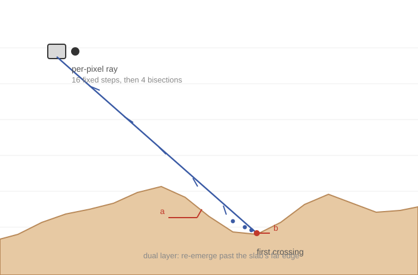

A full-screen pass reconstructs the near and far world-space point for each
pixel. The segment is sampled uniformly until it enters the encoded solid,
then four binary-search iterations refine the first crossing. For a
single-level texel, points at or below `high` are solid. For a dual-level
texel, `z <= low` and `mid <= z <= high` are solid. Testing this predicate
directly is important: it detects floors, slab tops, and cave ceilings for
rays travelling in either vertical direction.

```
function RAYMARCH(o, d, steps):
    a, b ← o, clip(o, d)                 // far plane or z = 0
    for i ← 1 to steps:
        c ← a + (b − a) / (steps + 1)
        if SOLID(c): b ← c; break
        else a ← c
    for i ← 1 to 4:                      // bisection
        c ← (a + b) / 2
        if SOLID(c): b ← c else a ← c
    return b if hit else MISS

SOLID(p) := p.z ≤ low(p.xy)  ∨  mid(p.xy) ≤ p.z ≤ high(p.xy)
```

The publication setting uses 128 forward samples over the clipped ray
segment. The budget is exposed as `--ray-steps` and is included in the
uniform tuning sweep. A sample interval can still skip a thinner feature;
that is the method's characteristic quality/performance tradeoff. Misses
return the cleared far depth instead of manufacturing a hit at the ground
plane. Hits write the reconstructed depth and therefore compose normally
with rasterized objects. The method needs no preprocessing or auxiliary
storage and remains the WebGL2 fallback.

### 3.2 Voxel-accelerated ray march

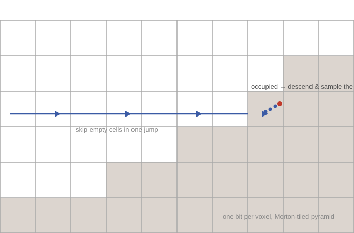

This path accelerates the same per-pixel query with a conservative occupancy
pyramid. The finest level stores one occupancy bit per voxel in Morton-coded
8×8×8 tiles; each higher level is the union of eight children. Traversal
uses a hierarchical DDA: an empty cell advances directly to its exit plane,
while an occupied cell descends until the leaf level, where fixed sampling
tests the original height data. The structure skips only known-empty space;
it does not replace the source surface with cubes.

```
function RAYVOXEL(o, d):
    lod ← coarsest
    while outer steps remain:
        if occupied(cell, lod) and lod > 0:
            lod ← lod − 1; continue      // descend into a child
        advance o to the cell exit
        if occupied and lod = 0:
            if a linear sample in the cell is SOLID: return hit
        else if the exit allows it: lod ← lod + 1
    return MISS
```

The publication comparison uses the coarse `(4,8,2)` occupancy grid
(18.29 MiB). The renderer's shipping `(2,4,1)` grid needs 153 MiB and did
not fit the software rasterizer used for tuning; §5.6 records that
choice. Every RayVoxel number in this paper is the coarse configuration.

The GPU builds the hierarchy incrementally because a whole-level dispatch
can exceed driver watchdog limits. Preparation therefore appears separately
in §5.3. Runtime traversal has outer- and inner-step budgets. Dense vertical
variation can exhaust them, and the storage-buffer requirement excludes the
WebGL2 path.

### 3.3 Sliced

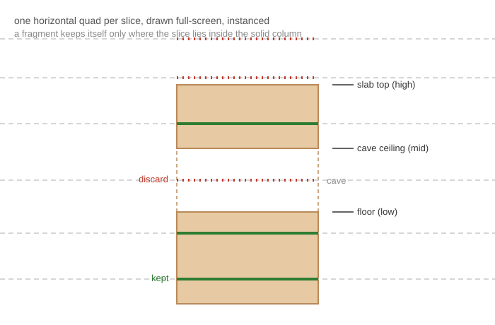

The renderer draws `N` horizontal quads across the visible terrain bounds.
For each fragment, the surface decoder keeps the sample when its altitude is
inside the floor column or upper slab and discards it in empty space. The
slices are spread over the full altitude range; reducing `N` therefore
coarsens the representation rather than deleting the lowest part of it.

```
for k ← 1 to N:
    z ← z_max − k · (z_max / N)
    draw a horizontal quad at z over the camera footprint
    for each fragment p:
        if p.z ≤ low(p.xy) or mid ≤ p.z ≤ high: shade(p)
        else discard
```

At the 256 quantized altitude levels, one slice per unit samples every
representable height. The tuned setting uses 512 slices. At grazing angles,
however, discrete planes remain visible as coherent horizontal bands and
can repeatedly cover a silhouette. This pattern can resemble a cast shadow
in a comparison image, but it is slice quantization; the shadow lookup is
the same one used by every other method.

### 3.4 Painted

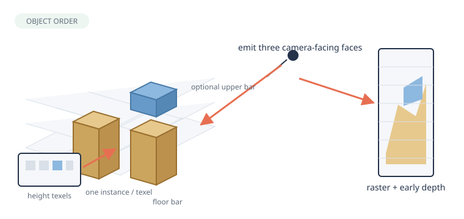

Painted turns each ground sample into explicit column geometry. One bar
extends from zero to the floor; a dual-level sample adds a bar from cave
ceiling to slab top. The vertex shader emits only the three faces oriented
toward the camera. It derives every position from the instance index, so no
per-column vertex stream is uploaded.

```
for each ground sample (x, y) in the camera footprint, front to back:
    emit a bar [0, low] with the three camera-facing faces
    if dual: emit a bar [mid, high]
rasterize with the ordinary depth test
```

The instance range is an axis-aligned bound of the camera footprint on the
terrain. Ordering the generated samples front-to-back lets early depth tests
remove most covered fragments; the original implementation measured 96%
early-Z rejection for its test view. Cost still scales with ground samples
inside the footprint rather than with visible pixels, which explains its
poor downward-looking timings. Although it also processes terrain in object
order, its explicit bar geometry is not a reconstruction of the original
software renderer.

### 3.5 Scattered

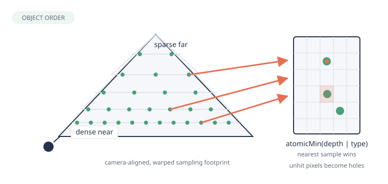

Scattered is the method that inherits the original engine's object-order,
line-by-line painter (§1) and recasts it as a parallel atomic scatter. A
compute grid samples a camera-aligned ground footprint whose longitudinal
coordinate is warped to spend more samples nearby. Each invocation walks
both encoded vertical
intervals and projects point samples into a screen buffer. Parallel GPU work
cannot rely on painter ordering, so a 32-bit `atomicMin` selects the nearest
result while retaining 24 bits of depth and 8 bits of terrain type. A
full-screen resolve reconstructs world position and performs material,
diffuse, fog, cave-ambient, and shadow evaluation.

```
clear the screen buffer to ∞
for each warped footprint sample (x, y), in parallel:
    scatter (x, y, mix(low, 0, t)) for t ∈ [0, 1]
    if dual: scatter (x, y, mix(high, mid, t))
scatter(p): atomicMin(buf[project(p)], pack(depth(p), type))
resolve: reconstruct world position from the packed depth and shade
```

The density vector controls the compute grid. Unlike rasterization, point
projection does not guarantee pixel coverage; undersampling appears as
isolated gaps and unstable pixels, especially near the horizon. The
coherence metric in §4.2 is intended to expose exactly this failure.

### 3.6 Mesh

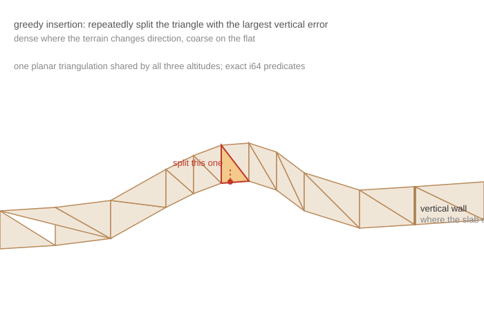

The mesh path fits an explicit surface with greedy point insertion following
Garland and Heckbert [1995]. Each triangle tracks the source sample with the
largest vertical error; the globally worst sample is inserted until the
tolerance is met. Integer grid coordinates allow orientation and incircle
predicates to remain exact on the many cocircular cells.

One planar triangulation is shared by `low`, `mid`, and `high`. A sample is
inserted when any of the three fields exceeds tolerance, and boundary walls
close the upper slab where dual-level encoding begins or ends. This coupling
is the source of the fit-cost result in §6.

```
for each 128×128 chunk:
    T ← Delaunay of the four corners
    while max vertical error of T over {low, mid, high} > τ:
        insert the worst sample and restore Delaunay
    emit floor triangles; emit slab + walls on dual-region edges
draw the selected LOD with ordinary rasterization
```

The level is partitioned into 128×128 chunks with three fitted detail levels.
Chunks are frustum culled and selected by camera distance. Boundaries use a
stable finest-level vertex sequence so neighbouring LODs do not crack. The
tradeoff moves out of the frame loop: fitting is a blocking CPU cost, the
full-level renderer retains all three GPU LODs plus the editable CPU
triangulation, and edits require local refinement. At the selected q=0.5
those explicit method-specific allocations are reported in §5.4; they
are substantially more than counting only the finest LOD.
Once present, the geometry uses the conventional raster pipeline and supplies
the triangle's own geometric normal for lighting, which is defined on
vertical walls and cave ceilings where a height-field gradient is not.

The explicit mesh can be reused as a conventional triangle collider, which
mainstream rigid-body libraries accept and the original two-interval height
map is not. That reuse is a system-level consequence, not a measurement
here. It also widens the edit obligation: a refitted visual chunk would
need its collider replaced on the same consistency boundary.

## 4. Evaluation

### 4.1 Reference

A CPU ray cast of the same height data with the same camera, marching
coarsely and bisecting within the bracketing interval. It yields a sky
mask and a distance field.

Two mistakes in building this are worth recording because both produced
plausible, wrong numbers for some time.

The reference camera's focal length was scaled by render height while the
renderer's is fixed in pixels. The two agree only at one resolution; at
1080p the reference would have had a 3.6× wider field of view than the
image it was scoring.

The solidity test guarded the floor comparison with `z >= 0`, which makes
a texel of height zero unhittable — no `z` satisfies both `z >= 0` and
`z < 0`. Sea level is a real height on these maps, so every downward ray
over water was classified as sky. It cost 23% of a straight-down frame.

### 4.2 Metrics

**Coverage**, decomposed. `see-through` is solid terrain the renderer left
as background; `covers-sky` is background it filled in. The decomposition
is what makes them diagnostic: only the first moves when a renderer is
genuinely missing geometry, and both move together when the reference is
the one disagreeing about a silhouette.

**Geometry.** Median and 95th-percentile distance error where renderer and
reference agree something is present. This must be read comparatively:
its floor is set by grazing incidence and by the scene's sampling
discontinuities (§6.1).

**Coherence.** The fraction of pixels whose distance disagrees with their
own 3×3 neighbourhood, in excess of the reference doing the same.

Coverage alone cannot detect over-drawing: a renderer that interpolates a
slab across region boundaries covers every pixel that should be covered.
Comparing depth found that class of defect; coherence finds striping,
speckle, and cracks that correct-on-average depth still misses.

### 4.3 Protocol

Every number in this paper is produced by one command with no arguments
(`tools/compare-terrain.py`), whose defaults *are* the publication
configuration: every method, twelve viewpoints (three per pitch, at 0°,
−30°, −60°, −90°), 1280×800, 40 timed frames after per-method warmup.
The harness builds the binaries, fetches and converts the level on first
run, and names its output after the adapter wgpu selected, so runs
collected from different machines merge without hand-labelling
(`tools/merge-bench.py`). The design goal is that a measurement session
on a new device costs its owner one invocation and about an hour — the
protocol is only as reproducible as it is cheap to follow.

On Vulkan, frame times come from GPU timestamp queries around the frame's
command encoder. Encoder-level timestamps did not reliably bracket this
multipass workload on Metal: the returned intervals were quantised,
nearly method-independent, and much shorter than submit-to-completion. This is
a measurement failure, not evidence that Metal rendered incorrectly. wgpu
explicitly does not guarantee strict ordering for arbitrary command-encoder
timestamps, and its Metal backend may defer such a write to the next native
pass. We treated the pair as a guaranteed enclosing interval, which the API
does not promise. A future GPU-only measurement must timestamp each render and
compute pass and sum those intervals; the present Apple run conservatively
uses the retained CPU submit-and-wait average instead. Each row records its
timing source because the two mechanisms are not directly comparable (§5.2).
The publication configuration renders the same 1024² height-field shadow
map for every method. This deliberately measures a complete, visually
comparable terrain frame rather than an isolated discovery pass. The JSON
records the shadow mode, and `--no-shadows` is available for a separate
method-only diagnostic run. The final hardware batch uses this protocol;
visual review of all five grids confirms that the common pass reaches every
column.
One-time costs are recorded separately as setup / first frame / warmup
(§5.3), since per-frame figures structurally exclude them. Accuracy is
expected to be device-independent; the merge tool reports a baseline once
and cross-checks every field from the other devices, because an adapter
that disagrees about geometry is a finding, not noise.

### 4.4 Dynamic-edit protocol

The headless runner's `--dig` path removes altitude and upper-layer metadata
inside a radius-48 crater centred at (1024, 8192) and submits the same dirty
rectangle used by the interactive game. The timing camera is at (1024, 8350),
40 units above the original surface, yaw 180°, pitch −30°. For each method the
protocol records (1) the median of five independently constructed first
post-edit frames, both as CPU submit-and-wait and as GPU timestamps when
the adapter provides them, (2) consistency after 1, 2, 4, 8, or 16
frames, and (3) colour and depth agreement with a fresh renderer constructed
from the already-edited level. Consistency means at most 0.01% hit/miss
disagreement and p95 depth difference at most 0.1 world unit. The §5.4
figure uses a closer, higher view of the same crater so the bowl is
readable; the numbers always come from the timing camera.

The same run reports explicit persistent method data: renderer-owned GPU
buffers and retained CPU acceleration or fitting structures. Shared terrain,
palette, color/depth and shadow textures, pipelines, staging allocations, and
opaque driver memory are excluded. This narrower measure is portable and
auditable through wgpu; whole-process RSS or backend heap telemetry is not.
The edit test remains separate from the steady-state protocol because
averaging an update into 40 ordinary frames would hide the cost that the
constraint exists to expose.

## 5. Results

The publication comparison uses one six-method set throughout: RayTraced
128, RayVoxel 100, Sliced 512, Scattered 4,4,4, Painted, and Mesh q=0.5.
Every run is 1280×800 with far distance 600, 40 timed frames, a common
1024² ray-traced shadow pass, and the same twelve camera records. The
five-device batch is AMD Radeon 780M, AMD Radeon RX 7900 XT, Intel
RPL-U, NVIDIA GeForce RTX 5070, and Apple M3. Vulkan rows use GPU
timestamps; the M3 uses CPU submit-and-wait. Complete per-view tables
and driver versions are in `paper/results.md`.

### 5.1 Pitch is the axis that separates them

Values below are arithmetic means over the three views at each pitch,
reported as see-through / coherence error (%), from the Radeon 780M
run and cross-checked on the other four adapters. `covers-sky` is
omitted because its pitch mean is at most 0.2% for every selected
configuration (§6.1).

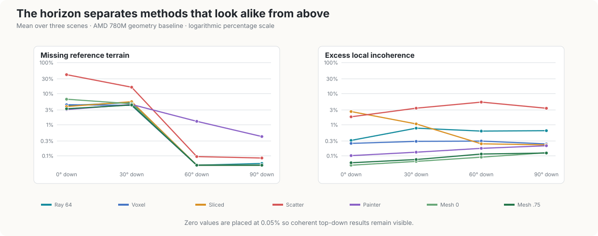

| pitch | RayTraced 128 | RayVoxel 100 | Sliced | Scattered | Painted | Mesh q=0.5 |
|---|---|---|---|---|---|---|
| 0° | 0.6 / 0.4 | 0.0 / 0.2 | 0.9 / 2.7 | **40.4 / 1.8** | 0.0 / 0.1 | 0.3 / 0.1 |
| −30° | 0.6 / 0.9 | 0.0 / 0.2 | 2.3 / 1.4 | **15.4 / 3.5** | 0.3 / 0.1 | 0.4 / 0.1 |
| −60° | 0.1 / 0.7 | 0.0 / 0.3 | 0.0 / 0.2 | 0.3 / **5.7** | 2.7 / 0.1 | 0.0 / 0.1 |
| −90° | 0.1 / 0.5 | 0.0 / 0.3 | 0.0 / 0.2 | 0.1 / **3.7** | 0.8 / 0.2 | 0.0 / 0.1 |

The image-order methods join the coherent group. Scattering is the
horizon outlier: its three scenes leave 19.1–73.2% of reference terrain
uncovered, while the other methods' pitch means lie between 0.0% and 0.9%.
Looking down removes its coverage deficit but not its point-scale
incoherence. Slicing shows the complementary signature: good coverage but
visible horizontal bands, measured as 2.7% coherence error at 0°.

The selected mesh sits with the coherent group. At the hangar view q=0.0
left 11.0% uncovered; q=0.5 leaves 0.5% and recovers the wall. The five
image grids agree on that geometry: hangar Mesh see-through is 0.519% on
every adapter. The only material cross-device spread is inside the already
failing Scattered hangar row (73.2% on the 780M versus 74.0% on the M3).

**Methods developed from top-down screenshots can conceal failure modes
that become dominant at eye level.** Point scattering loses coverage,
slicing bands, and an aggressively simplified mesh can miss a
scene-specific wall; the image-order methods, Painted, and the selected
mesh remain mutually coherent.

### 5.2 Frame time

The timing table uses the same six configurations as §5.1. Vulkan rows
use GPU timestamps; Apple M3 rows marked `*` use CPU submit-and-wait
because encoder-level timestamps do not enclose the Metal workload
(§4.3).

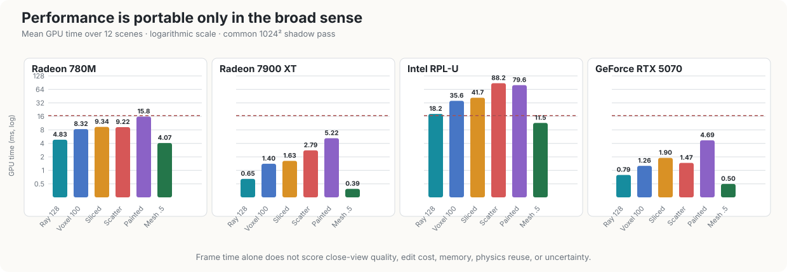

| device / pitch | RayTraced 128 | RayVoxel 100 | Sliced | Scattered† | Painted | Mesh q=0.5 |
|---|---|---|---|---|---|---|
| 780M / 0° | 4.562 | 8.143 | 10.437 | 14.179 | 8.441 | **4.072** |
| 780M / −30° | 4.871 | 9.123 | 7.809 | 8.658 | 12.853 | **4.152** |
| 780M / −60° | 4.838 | 8.254 | 8.974 | 6.970 | 20.058 | **3.974** |
| 780M / −90° | 5.044 | 7.762 | 10.142 | 7.072 | 22.005 | **4.081** |
| 7900 XT / 0° | 0.574 | 1.365 | 1.781 | 7.897 | 3.035 | **0.384** |
| 7900 XT / −30° | 0.660 | 1.522 | 1.343 | 1.315 | 4.658 | **0.395** |
| 7900 XT / −60° | 0.658 | 1.415 | 1.604 | 0.991 | 6.837 | **0.385** |
| 7900 XT / −90° | 0.693 | 1.308 | 1.790 | 0.974 | 6.332 | **0.383** |
| Intel RPL-U / 0° | 15.751 | 34.681 | 54.498 | 104.370 | 45.628 | **11.745** |
| Intel RPL-U / −30° | 18.106 | 39.596 | 34.730 | 89.523 | 62.300 | **11.426** |
| Intel RPL-U / −60° | 17.591 | 34.433 | 34.862 | 87.927 | 86.566 | **11.256** |
| Intel RPL-U / −90° | 21.227 | 33.561 | 42.657 | 70.993 | 124.020 | **11.388** |
| RTX 5070 / 0° | 0.722 | 1.251 | 2.259 | 1.721 | 3.258 | **0.503** |
| RTX 5070 / −30° | 0.809 | 1.419 | 1.544 | 1.532 | 4.155 | **0.501** |
| RTX 5070 / −60° | 0.782 | 1.226 | 1.774 | 1.327 | 5.676 | **0.493** |
| RTX 5070 / −90° | 0.845 | 1.146 | 2.018 | 1.304 | 5.679 | **0.496** |
| Apple M3* / 0° | 8.219 | 12.378 | 12.284 | 40.524 | 16.944 | **5.307** |
| Apple M3* / −30° | 8.057 | 13.551 | 11.017 | 11.443 | 32.664 | **5.936** |
| Apple M3* / −60° | 8.172 | 12.173 | 12.110 | 10.681 | 49.750 | **6.302** |
| Apple M3* / −90° | 8.915 | 11.862 | 13.124 | 11.161 | 31.530 | **6.135** |

**\* Apple M3 values are CPU submit-and-wait means.** They include command
submission and the completion round trip, so they support comparisons among
methods on that device but not absolute comparisons with the Vulkan GPU rows.

At the selected quality point Mesh q=0.5 has the lowest twelve-scene mean
on every adapter: 4.070 ms on the 780M, 0.387 ms on the 7900 XT, 11.454 ms
on Intel, 0.498 ms on the RTX 5070, and 5.920 ms CPU on the M3. RayTraced
128 is second on four of the five; the 7900 XT and 5070 put the two within
0.3 ms, while Intel and the M3 open a larger gap. RayVoxel is consistently
about 1.6–2× RayTraced. Portability of an API and shader does not imply
portability of a performance ranking among the slower methods, but it does
not disturb this mesh-versus-ray order.

Painted has the clearest orientation dependence on every adapter, becoming
progressively slower as more ground samples enter its emitted footprint.
Scattered is less orderly: the hangar takes 29.3 ms on the 780M, 21.8 ms
on the 7900 XT, 148.9 ms on Intel, and 99.8 ms CPU time on Apple, but
only 2.5 ms on NVIDIA. †The pitch-0 arithmetic mean is therefore
dominated by a scene-and-adapter interaction and is not a general
horizon cost. On Intel the derived-volume and forward methods cost
34–124 ms while RayTraced and Mesh stay near 11–21 ms.

Within-session 95% intervals from the 40 frame samples, over the
twelve-scene mean:

| device | Ray 128 | Voxel 100 | Sliced | Scattered | Painted | Mesh .5 |
|---|---:|---:|---:|---:|---:|---:|
| Radeon 780M | 4.829±0.116 | 8.320±0.008 | 9.341±0.120 | 9.220±0.042 | 15.839±0.085 | 4.070±0.050 |
| Radeon 7900 XT | 0.646±0.007 | 1.403±0.001 | 1.629±0.010 | 2.794±0.003 | 5.216±0.002 | 0.387±0.003 |
| Intel RPL-U | 18.169±0.103 | 35.568±0.063 | 41.687±0.424 | 88.203±0.159 | 79.629±0.444 | 11.454±0.041 |
| RTX 5070 | 0.790±0.000 | 1.260±0.001 | 1.899±0.000 | 1.471±0.000 | 4.692±0.001 | 0.498±0.001 |
| Apple M3* | 8.341±0.032 | 12.491±0.014 | 12.134±0.016 | 18.452±0.022 | 32.722±0.036 | 5.920±0.068 |

The mesh–ray intervals do not overlap on any device. The M3 interval is
now honest: this collector kept the CPU sample arrays.

### 5.3 Preparation cost

Per-frame numbers exclude one-time work. The 780M run gives the
following CPU wall times in milliseconds (maximum over its twelve scenes):

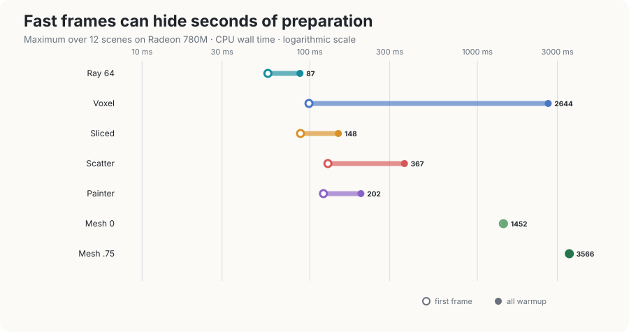

| method | setup | first frame | warmup |
|---|---|---|---|
| RayTraced | 9 | 60 | 101 |
| RayVoxel | 12 | 124 | **3163** |
| Sliced | 17 | 88 | 144 |
| Scattered | 10 | 127 | 362 |
| Painted | 18 | 119 | 200 |
| Mesh q=0.5 | 10 | **2464** | 2488 |

`setup` builds pipelines and uploads the terrain texture; `first frame`
adds whatever the method builds lazily; `warmup` covers every pre-timing
frame. The two methods that pay anything substantial pay it differently.
The mesh fits its triangulation once, on the CPU, in a single blocking
2.5 s at q=0.5 — a load-time cost that a level cannot be entered without.
The voxel grid bakes incrementally under a per-frame texel budget,
spreading 3.2 s across frames that are individually playable but render
through terrain the bake has not reached yet.

Neither is visible in a steady-state frame time, and for a level-loading
budget the difference between them matters more than the per-frame gap.

### 5.4 Editing and retained method data


The headless `--dig` path removes altitude and upper-layer metadata inside
a radius-48 crater and submits the same dirty rectangle the interactive
game would. The camera stands south of the crater at pitch −30° (§4.4).
Figure 5.4 shows the unedited view and the first updated frame for the
three update classes: RayTraced reads the new texture directly, RayVoxel
rebuilds affected occupancy, and Mesh refits dirty chunks. All six
methods receive the same edit; the figure shows one of each class.

Times below are medians on the Radeon 780M. `first edit` has five
independent samples of the first post-edit frame. CPU is submit-and-wait
(upload + any refine + GPU work + round trip): that is the latency a
player waits. GPU is the timestamped draw of that same frame. `steady`
is the median of ten frames from a fresh build of the already-edited
level.

| method | CPU steady | CPU first | CPU Δ | GPU steady | GPU first | GPU Δ | fresh-build equivalence |
|---|---:|---:|---:|---:|---:|---:|---|
| RayTraced 128 | 6.51 | 8.70 | +2.19 | 5.59 | 7.45 | +1.86 | exact after 1 frame |
| RayVoxel 100 | 7.54 | 9.00 | +1.46 | 6.60 | 6.97 | +0.37 | exact after 1 frame |
| Sliced | 7.79 | 10.97 | +3.18 | 6.91 | 9.60 | +2.69 | exact after 1 frame |
| Scattered | 8.41 | 10.16 | +1.75 | 7.37 | 8.65 | +1.28 | exact after 1 frame |
| Painted | 17.89 | 22.72 | +4.83 | 16.87 | 21.04 | +4.17 | exact after 1 frame |
| Mesh q=0.5 | 6.07 | 15.94 | +9.88 | 4.77 | 6.07 | +1.30 | not equivalent by 16 frames |

On this integrated GPU the first updated frame also costs extra GPU time
for the methods that upload or rebuild, because the dirty work is not
hidden behind a fast discrete queue. The mesh is still the outlier: its
CPU Δ is 9.88 ms while its extra GPU time is only 1.30 ms. Across the
five devices Mesh CPU Δ is 5.0–9.9 ms (7900 XT 5.03, M3 5.98, RTX 5070
7.31, Intel 9.83, 780M 9.88). The five direct or regularly rebuilt
methods match a fresh edited build on the first updated frame on every
adapter. The mesh does not: at 16 frames it still differs by 0.0016%
hit/miss classification, 0.22 u p95 depth, and 0.78–0.80 levels of
8-bit color MAE, identically on all five devices. That remainder sits
inside the q=0.5 tolerance; exact rebuild equivalence is nevertheless a
stronger property than this implementation provides.

The publication batch is a clean checkout of `5586e2a` (`terrain-paper`)
on all five machines.

At 1280×800 the same run reports explicit, persistent, method-specific
allocation. Zero means the method adds no persistent data beyond the
shared renderer resources excluded in §4.4.

| method | GPU data (MiB) | CPU data (MiB) |
|---|---:|---:|
| RayTraced 128 | 0 | 0 |
| RayVoxel (4,8,2) | 18.29 | <0.01 |
| Sliced | 0 | 0 |
| Scattered | 3.91 | 0 |
| Painted | <0.01 | 0 |
| Mesh q=0.5 | 318.7 | 534.7 |

RayVoxel's tuned coarse grid is only 18.29 MiB; its 153 MiB production
grid remains a distinct, disclosed configuration (§5.6). Scattered's
3.91 MiB is one 32-bit value per output pixel and therefore scales with
resolution. The mesh retains three LODs plus every chunk's live
triangulation. These figures are explicit payload sizes, not peak
process or driver memory.

### 5.5 Fit cost

Fostral, triangles against a full grid mesh:

| quality | max error | vertices | triangles | reduction |
|---|---|---|---|---|
| 0.0 | 16 | 1.74 M | 3.39 M | 19.8× |
| 0.25 | 8 | 2.31 M | 4.50 M | 14.9× |
| 0.5 | 4 | 4.28 M | 8.47 M | 7.9× |
| 0.75 | 2 | 7.14 M | 14.1 M | 4.7× |
| 1.0 | 1 | 11.3 M | 22.4 M | 3.0× |

Against roughly 80× for a smooth synthetic surface at comparable
tolerance (our own control, not a literature figure), and 45–182× for
the single-layer stock worlds (§6.2). The
stock worlds are the better control than an external elevation model
would be: they vary only content, holding encoding, quantisation, texel
scale and authoring pipeline fixed, so the comparison isolates one
variable rather than four.

### 5.6 Tuning

Each method was swept over its own quality knob and given the cheapest
setting within one percentage point of its own best error, so no method
is charged for a setting that buys nothing or credited with speed it
reaches only by being wrong. Fostral, three viewpoints at the horizon,
400x260, view distance 600. The CPU reference was re-swept after correcting
its screen-X basis and far-plane convention. The mesh received an additional
1280×800 pass because its wall coverage was not resolved at tuning resolution.
The complete sweeps are recorded in `paper/tuning.md`.

| method | knob | swept | chosen | error at choice |
|---|---|---|---|---|
| RayTraced | forward steps | 16–256 | **128** | 1.2% |
| Painted | — | none beyond view distance | — | 0.1% |
| Sliced | slices | 32–512 | **512** | 6.5% |
| Scattered | density | 1–4 | **4,4,4** | 39.2% |
| RayVoxel | grid, steps | 2 grids × 40–400 | **4,8,2, 100 steps** | 0.3% |
| Mesh | fit tolerance | q 0.0–1.0 | **q=0.5** | 0.3% at 1280×800 |

Four of the results are worth stating.

**The slicer knob changes the error's kind.** From 32 to 512 slices,
cost rises 0.31 → 1.54 ms while see-through falls 15.5% → 3.0%. Speckle is
non-monotonic because additional slices convert missing spans into isolated
wrong pixels before coverage becomes dense enough; the combined error falls
16.7% → 6.5%, so the rule selects 512.

**The voxel step budget is a property of the fixture, not the method.**
40 steps leaves 2.5% combined error, while 100 reaches 0.3%; 200 and 400
remain at 0.3% and only add work. The rule therefore selects 100. A step
budget tunes the longest sightline the
viewpoints put in frame; change the viewpoints and it needs re-tuning,
which is what the protocol's tuning pass is for.

**Resolution changes whether the reference can resolve mesh quality.** At
400×260 q=0.0 and q=0.25 both have 1.8% combined error, so the rule initially
chooses q=0.5 as the first point within one point of the 0.7% best. At
1280×800, q=0.0 leaves 3.9%, q=0.25 leaves 0.8%, and q=0.5–1.0 leave 0.3%.
The one-point rule would pick q=0.25. We publish **q=0.5** instead: it is
the coarsest setting that matches the full-resolution error floor, and it
lets the comparison, teaser, and video share one mesh. The hangar wall
that q=0.0 drops is recovered at this setting.

**The ray marcher selects 128 steps.** Across the final horizon
scenes, 16 → 256 steps costs 0.24 → 1.29 ms while total error falls 6.9% →
0.6%. The 128-step setting is the cheapest within one point of the best
(1.2%). A cheaper 64-step setting is not substituted for the selected one.

A fifth result is about configuration rather than the method: the voxel
tracer's production grid (2,4,1) needs 153 MB of storage buffer and did not
fit the software rasterizer used for tuning. The selected comparison runs the
(4,8,2) grid even though all five hardware devices can accommodate the
production grid. The reported comparison therefore characterises the
tuned coarse configuration, not the renderer's shipping configuration;
the memory requirement is part of the configuration disclosure rather than
an unreported advantage.

### 5.7 Fastest is not free

At the selected quality point Mesh q=0.5 is the lowest mean on every
device, and it is also in the coherent group of §5.1. Frame time is
therefore not the remaining argument against it. The remaining costs
are the ones the timing table hides: 2.5 s of blocking fit, 319 MiB of
GPU buffers and 535 MiB of CPU triangulation, and a 5–10 ms
history-dependent refit that never quite matches a fresh build.

RayTraced 128 is the other production-shaped choice. It is second in
the timing table, needs no extra memory, and sees a crater on the next
draw. Its fixed sampling budget is still visible as blocky close-up
detail, and grazing rays remain the worst possible workload. The
selected 128-step setting is the cheapest point within the tuning
rule, not a quality match for interpolated triangles.

The choice is consequently workload-level. RayTraced is compelling
when load time, memory, and exact first-frame edits dominate. Mesh is
the stronger candidate when close-range quality, grazing views, or a
triangle-mesh collider matter enough to amortise fitting and local
refits. The new measurement is that those mesh advantages no longer
have to be bought with a slower frame.

## 6. Findings

### 6.1 The remaining depth offset

After the reference corrections in §4.1, `covers-sky` at all three −90°
scenes is exactly 0.0% for every method, and the pitch means remain at or
below 0.2%. The selected coherent methods leave at most 0.9% uncovered at
the horizon.

One limitation stays visible in the numbers. In extremely wide off-axis
top-down pixels, otherwise agreeing methods share median absolute offsets
of roughly 8–14 world units against the CPU point marcher. Halving its
step did not remove the offset, so this is a point-sampling or cell-boundary
convention rather than insufficient convergence. Absolute depth is therefore
a diagnostic, not evidence for sub-unit ranking. Quality claims rest on
bidirectional coverage, coherence, visual agreement, and relative agreement
between independent renderers.

### 6.2 The multi-layer encoding, not the terrain, sets the fit cost

The obvious reading of a 14.9× reduction where a smooth surface gives
~80× is that hand-authored terrain is simply harder to fit. The ten
shipped worlds let us test that directly: same engine, same encoding,
same 8-bit quantisation, same texel scale, same authoring tools, varying
only content. Fitted at identical tolerance:

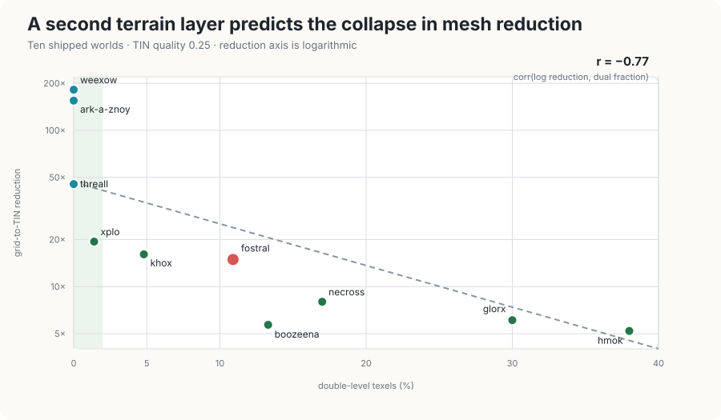

| level | texels | triangles | reduction | slab tris | dual texels | rough(floor) | rough(surface) |
|---|---|---|---|---|---|---|---|
| weexow | 4.2 M | 0.05 M | 182.0× | 0.0% | 0.0% | 1.84 | 1.84 |
| ark-a-znoy | 4.2 M | 0.05 M | 154.8× | 0.0% | 0.0% | 5.52 | 5.52 |
| threall | 4.2 M | 0.19 M | 45.3× | 0.0% | 0.0% | 2.85 | 2.85 |
| xplo | 8.4 M | 0.87 M | 19.4× | 17.0% | 1.4% | 7.54 | 8.80 |
| khox | 4.2 M | 0.52 M | 16.1× | 9.3% | 4.8% | 6.94 | 7.71 |
| fostral | 33.6 M | 4.50 M | 14.9× | 35.6% | 10.9% | 3.44 | 6.54 |
| necross | 33.6 M | 8.41 M | 8.0× | 42.5% | 17.0% | 4.41 | 14.43 |
| glorx | 33.6 M | 10.97 M | 6.1× | 37.2% | 30.0% | 6.53 | 14.66 |
| boozeena | 4.2 M | 1.46 M | 5.7× | 41.5% | 13.3% | 3.44 | 25.15 |
| hmok | 4.2 M | 1.61 M | 5.2× | 47.2% | 38.0% | 2.71 | 18.77 |

`rough(floor)` is the mean absolute discrete Laplacian of the `low` layer
alone — the terrain's own curvature, blind to the second layer.
`rough(surface)` is the same measure on the composite surface the fitter
sees.

The hypothesis fails. Across all ten worlds, correlation of log
reduction against `rough(floor)` is **−0.17**; against the double-level
texel fraction it is **−0.77**, and against `rough(surface)` — the data
the fitter actually sees, curvature the slab edges put there — it is
**−0.82**. (The share of the fitted triangles that end up on slab
surfaces correlates at −0.89, which is the fit's own account of where
its budget went rather than an independent predictor.) Relief does not
predict the fit cost; the second layer does. `ark-a-znoy` makes the
floor-relief hypothesis fail in the other direction too: it is *three*
times as rough as `weexow` on the floor (5.52 against 1.84) and
compresses essentially as well (154.8× against 182.0×), because neither
world has a slab.

The clearest case is `hmok`. Its floor is *smoother* than `threall`'s
(2.71 against 2.85), and `threall` compresses 45.3×. `hmok` manages
5.2× — nine times worse on flatter ground — because 47% of its triangles
are slab. Its composite roughness is seven times its floor roughness, and
all of that excess is the encoding.

So the honest claim is not that authored terrain defeats greedy TIN.
Single-layer authored terrain compresses 45–182× in our own controls,
which confirms the fitter itself is not the weak link without importing a
ratio from a differently sampled elevation model. What defeats it is a
second layer whose altitudes are structural rather than continuous. §6.3
is the mechanism.

### 6.3 A quarter of the vertex budget goes to one discontinuity

Counting what drove each insertion, Fostral at quality 0.25:

| driver | share |
|---|---|
| `low` (the floor) | 53.5% |
| slab interior | 18.8% |
| **single/double-level boundary** | **23.3%** |
| chunk-border simplification | 4.4% |

A single-level texel reports `mid = high = low`, so both step by the full
slab thickness across a region edge, and the error metric chases a
discontinuity no tolerance can satisfy — it only shrinks triangles toward
texel size along every boundary. The absolute cost is near-constant in
quality (338 k insertions at q=0, 396 k at q=1) while the floor's grows
444 k → 6.1 M. That signature — flat in tolerance — distinguishes a
geometric feature from a fit converging, and generalises to any
error-driven fit over a field with embedded discontinuities.

Constraining the triangulation to the region outline would remove it, and
is the same change that would stop straddling triangles dropping the slab.

### 6.4 Coverage metrics cannot see over-drawing

Coverage alone cannot fail a renderer that draws too much. A mesh that
interpolates a slab across region boundaries covers every pixel that should
be covered, and a see-through score treats that invented roof as correct.
That is why §4.2 splits coverage into see-through and covers-sky and adds a
depth-coherence score: the hangar wall dropped at q=0.0 is recovered by
comparing depth and by looking at the image, not by counting covered pixels.

## 7. Limitations

- One engine and one terrain format. The ten stock worlds span a factor
  of 35 in fit cost and isolate the multi-layer variable cleanly, but
  every one of them is Vangers data. Whether the mechanism in §6.3
  generalises to other discontinuous auxiliary fields is argued, not
  measured.
- All rendering comparisons use Fostral, published under CC BY-SA 4.0
  by Association K-D Lab. The nine additional survey worlds are not in
  that grant; those rows require a lawfully obtained game copy.
- The hardware batch covers four Vulkan devices and one Metal device, but
  not D3D12, WebGL2, mobile-class adapters, or multiple driver versions
  per adapter. It establishes native WebGPU execution and image agreement
  across those backends, not a survey of every WebGPU implementation. The
  browser smoke test is a path-to-the-web check of one route, not a
  six-method web comparison.
- Frame timing is per-frame latency, not pipelined throughput: each frame
  is submitted and awaited in isolation, so nothing overlaps. The
  Vulkan timestamps make those numbers GPU work rather than round trip, but
  they do not make them a frame rate. Metal uses CPU submit-and-wait because
  its encoder timestamps failed the bracketing sanity check; those values are
  useful within the M3 rows but cannot be compared directly with Vulkan.
- Tuning uses one fixed three-scene horizon fixture. It selects 128
  height-field steps, 100 voxel steps, and q=0.5 at publication
  resolution; changing the view-distance or scene distribution can
  select another operating point (§5.6).
- The edit experiment covers one crater shape and one location on all
  five publication adapters. It establishes first-frame visibility,
  CPU and GPU update cost, and mesh history dependence. A different
  crater or a gameplay-shaped destruction pattern is not measured.
- Explicit method payloads are accounted for, but portable wgpu does not
  expose opaque driver allocations or a backend-independent peak heap.
  Chunk streaming is not implemented, so "runs on low-end devices"
  describes the pipeline, not its memory budget.

## 8. Conclusion

Six terrain renderers that look interchangeable from the original game's
top-down camera behave differently once the same authored data is viewed
at eye level. Horizontal slices expose bands and point scattering exposes
incoherent pixels. At the selected quality point the mesh has the lowest
mean frame time on every measured adapter, and it stays in the coherent
group at the horizon. Close detail remains blocky on the marchers. The
mesh's remaining cost is memory, a 2.5 s fit, and a history-dependent
refit — not the frame.

The larger result is about the data and the measurement. Single-layer
worlds fit by 45–182×, while the structural second layer, not floor relief,
predicts the collapse in reduction; nearly a quarter of Fostral's vertex
insertions serve one layer-boundary discontinuity. The five direct or
regularly rebuilt methods reproduce a fresh edited build on their first
updated frame, but the selected insertion-only mesh retains a small
history-dependent difference. Making that mesh editable also exposes its
retained cost: 319 MiB of explicit GPU geometry and 535 MiB of CPU
triangulation. A credible comparison needs bidirectional coverage, coherence,
inter-method agreement, equal tuning, explicit preparation costs, and
visual parity checks in addition to a timing table. It also needs to
treat post-edit maintenance as a first-class result: a static hierarchy
can win a frame and still fail the workload if terrain destruction
forces a reload. Conversely, a method can win the timing table and still
lose the application if its quality budget is view-dependent or its
representation cannot be reused by the rest of the engine.

## Acknowledgements

I thank Association K-D Lab for *Vangers* and for publishing the Fostral
world data that this comparison uses; Yury Zhuravlev for maintaining the
open-source Vangers tree; and the players and other maintainers who have
kept the game alive for nearly three decades.

Large language models — OpenAI Codex, Anthropic Claude, and xAI Grok —
assisted with drafting, editing, literature search, and work on the
evaluation harness. I reviewed every claim, number, and citation; the
remaining errors are mine.

## Figure provenance

The paper now uses figures rather than treating them as a future pass. The six
method schematics are hand-authored SVGs with one vocabulary. The encoding,
pitch/quality, Vulkan performance, preparation, and ten-world fit figures are
generated by `tools/plot-paper.py`; hardware plots read the retained JSON
directly and the survey plot reads `paper/survey.json`, replaceable by
`tools/level-survey.py --json-out paper/survey.json`. The teaser is six hangar stills at the selected configurations, composed
by `tools/plot-paper.py`. The crater figure is the unedited view and the
first updated frame for RayTraced, RayVoxel, and Mesh. Full five-device
grids and per-view tables remain supplemental evidence rather than being
shrunk into unreadable paper pages. `tools/render-paper-video.py` renders a synchronized
six-configuration mosaic from the −30° portal camera at (1176, 11567),
raised to eye height 180, moving 520 world units horizontally along yaw 308°
at fixed altitude, pitch −30°, over eight seconds at 30 frames/s. The video
uses Fostral and is covered by the same CC BY-SA 4.0 attribution. The
flythrough does not include a terrain edit; edit evidence is the §4.4 /
§5.4 protocol, not the video.

## References

- Garland, M. and Heckbert, P. 1995. *Fast Polygonal Approximation of
  Terrains and Height Fields.* CMU-CS-95-181.
- Fowler, R. and Little, J. 1979. *Automatic extraction of irregular
  network digital terrain models.* SIGGRAPH.
- Shewchuk, J. R. 1997. *Adaptive Precision Floating-Point Arithmetic and
  Fast Robust Geometric Predicates.*
- Douglas, D. and Peucker, T. 1973. *Algorithms for the reduction of the
  number of points required to represent a digitized line or its
  caricature.* Cartographica. (Chunk-border simplification, §3.6.)
- Duchaineau, M. et al. 1997. *ROAMing terrain: real-time optimally
  adapting meshes.* IEEE Visualization. [Project and paper](https://www.cognigraph.com/ROAM_homepage/).
- Ulrich, T. 2002. *Rendering massive terrains using chunked level of
  detail control.* SIGGRAPH course.
- Losasso, F. and Hoppe, H. 2004. *Geometry clipmaps.* SIGGRAPH.
  [Author manuscript](https://hhoppe.com/geomclipmap.pdf).
- Amanatides, J. and Woo, A. 1987. *A fast voxel traversal algorithm for
  ray tracing.* Eurographics. (The DDA that §3.2 runs hierarchically.)
- Laine, S. and Karras, T. 2010. *Efficient sparse voxel octrees.* I3D.
  (The contrast: §3.2's voxels accelerate an exact height field rather
  than replace it.) [NVIDIA Research](https://research.nvidia.com/publication/2010-02_efficient-sparse-voxel-octrees).
- Policarpo, F., Oliveira, M. and Comba, J. 2005. *Real-time relief
  mapping on arbitrary polygonal surfaces.* I3D. (Per-pixel height-field
  marching lineage for §3.1.) [Author manuscript](https://www.inf.ufrgs.br/~comba/papers/2005/tog-2005.pdf).
- Tevs, A., Ihrke, I. and Seidel, H.-P. 2008. *Maximum mipmaps for fast,
  accurate, and scalable dynamic height field rendering.* I3D.
  [Max Planck publication record](https://pure.mpg.de/pubman/item/item_1325622).
- Benes, B. and Forsbach, R. 2001. *Layered data representation for visual
  simulation of terrain erosion.* SCCG, 80–86.
  [doi:10.1109/SCCG.2001.945341](https://doi.org/10.1109/SCCG.2001.945341).
- Alonso, J. and Joan-Arinyo, R. 2008. *The Grounded Heightmap Tree: A New
  Data Structure for Terrain Representation.* GRAPP, 80–85.
  [doi:10.5220/0001094300800085](https://doi.org/10.5220/0001094300800085).
- Graciano, A., Rueda, A. J., Pospíšil, A., Bittner, J. and Beneš, B. 2021.
  *QuadStack: An Efficient Representation and Direct Rendering of Layered
  Datasets.* IEEE TVCG 27(9), 3733–3744.
  [doi:10.1109/TVCG.2020.2981565](https://doi.org/10.1109/TVCG.2020.2981565).
- Shade, J., Gortler, S., He, L.-W. and Szeliski, R. 1998. *Layered Depth
  Images.* SIGGRAPH.
  [Microsoft Research](https://www.microsoft.com/en-us/research/publication/layered-depth-images/).
- Mantler, S. and Jeschke, S. 2006. *Interactive Landscape Visualization
  Using GPU Ray Casting.* GRAPHITE.
  [TU Wien publication record](https://www.cg.tuwien.ac.at/research/publications/2006/Mantler-06-landscape/).
- Cabral, B., Cam, N. and Foran, J. 1994. *Accelerated volume rendering and
  tomographic reconstruction using texture mapping hardware.* Symposium on
  Volume Visualization. [doi:10.1145/197938.197972](https://doi.org/10.1145/197938.197972).
- Westover, L. 1990. *Footprint evaluation for volume rendering.* SIGGRAPH.
  [Paper](https://cgl.ethz.ch/teaching/scivis_common/Literature/Westover90.pdf).
- Zwicker, M., Pfister, H., van Baar, J. and Gross, M. 2001. *Surface
  Splatting.* SIGGRAPH. [MERL publication record](https://www.merl.com/publications/TR2001-20).
- K-D Lab / KranX. *Vangers* source release, `KranX/Vangers`, GPL-3.0,
  [GitHub](https://github.com/KranX/Vangers). (Primary record of the original
  renderer.)
- Association K-D Lab. *Vangers — Fostral world data*, CC BY-SA 4.0,
  commit `f1ad7d7`,
  [`data/thechain/fostral`](https://github.com/KranX/Vangers/tree/master/data/thechain/fostral).
- Malyshau, D. 2020. *A Taste of WebGPU in Firefox.* Mozilla Hacks.
  [Mozilla](https://hacks.mozilla.org/2020/04/experimental-webgpu-in-firefox/).
- gfx-rs contributors. *wgpu: Safe and portable graphics for Rust.*
  [Project repository](https://github.com/gfx-rs/wgpu).
- W3C GPU for the Web Working Group. *WebGPU* and *WebGPU Shading Language*.
  [WebGPU specification](https://www.w3.org/TR/webgpu/);
  [WGSL specification](https://www.w3.org/TR/WGSL/).
- Malyshau, D. 2021. *Pure Rust.* vange-rs development log.
  [Project article](https://vange.rs/2021/08/25/pure-rust.html).
- Malyshau, D. 2019. *Data Formats.* vange-rs development log.
  [Project article](https://vange.rs/2019/12/12/data-formats.html).

