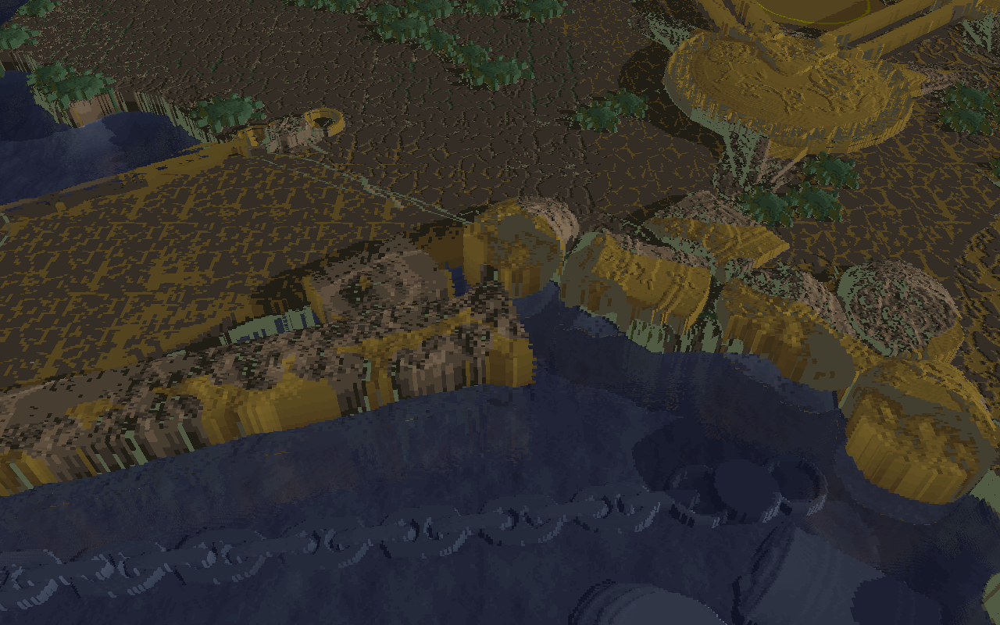
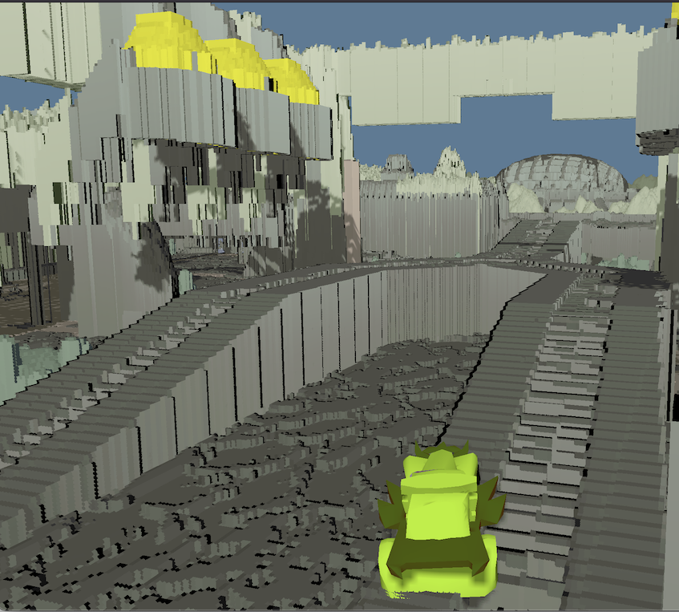
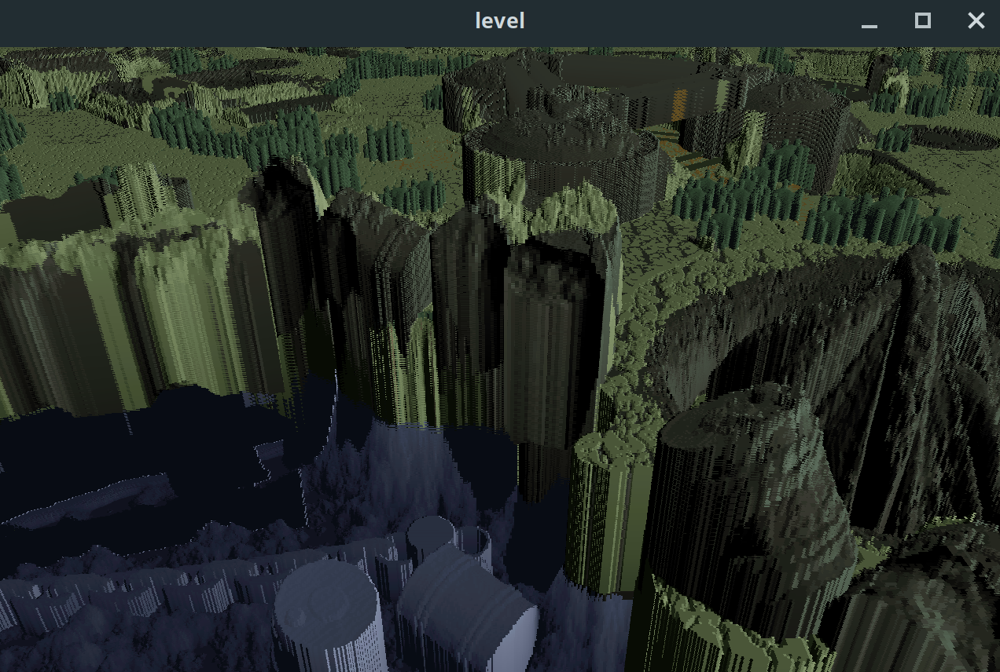
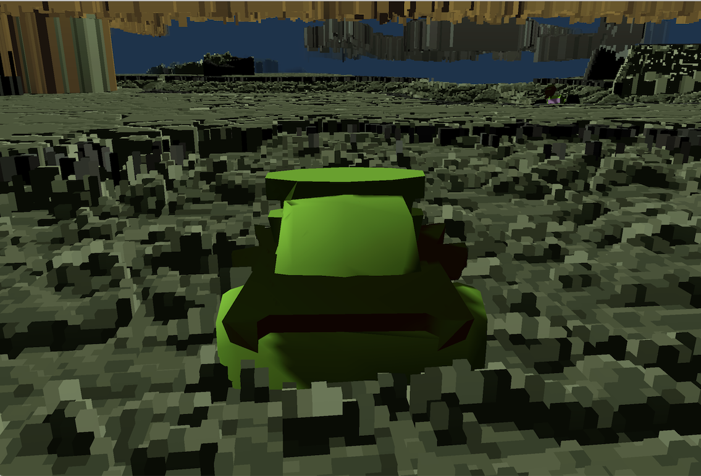
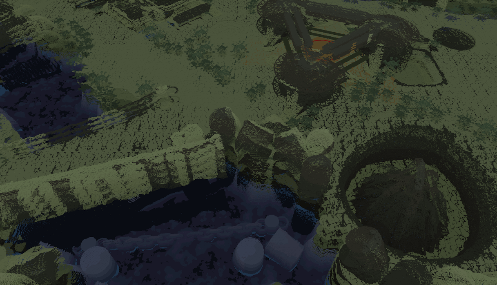
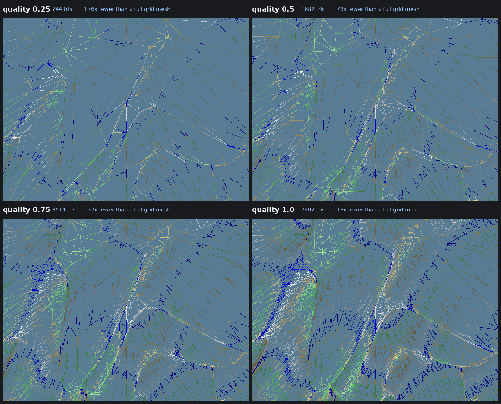

# Six Ways to Draw Vangers: Real-Time Rendering of Editable Multi-Layer Height Fields

**Status: measurement draft after hardware batch 2.** Three-device results
are integrated below. They remain diagnostic: the image audit led to new
horizon scenes, a full-screen dual-solid ray marcher, an exposed ray-step
knob, and a common shadow pass. A final hardware run is therefore required
before submission.

---

## Abstract

Terrain level-of-detail is measured almost exclusively on digital
elevation models: single-valued, smooth at the sampling scale, sampled
from real topography. Game terrain is often none of these. We compare six
rendering methods — height-field ray marching, voxel-accelerated ray
marching, sliced proxy geometry, per-sample bar rasterization, compute
scattering, and a fitted triangle mesh — implemented in a single engine
over a single data path, on the hand-authored multi-layer terrain of
*Vangers* (1998), scored against a CPU ray cast of the same source data.
Every method must preserve the two solid intervals available at a ground
sample, render at interactive rates, and reflect local terrain destruction
without reloading the level. These constraints rule out treating caves as
decoration or amortising a static preprocessing step over an immutable map.

We report three results. First, the cost of fitting a triangulated
irregular network to this terrain varies by more than an order of
magnitude across the ten shipped worlds, and what predicts the variation
is not the terrain's relief but the fraction of it carrying a second
layer. Worlds with a single layer compress by 45–182×; heavily double-level
worlds are several times worse, and a large share of the fit's vertex
budget is spent resolving one discontinuity — at a cost that does not fall
as the tolerance tightens, which is the signature of a geometric feature
rather than a fit converging. Second, the six methods are nearly
indistinguishable when the camera looks down and separate sharply as they
approach the horizon — the viewpoint the original engine never used, and a
modern first- or third-person camera cannot avoid.
Third, a correctness metric based on coverage alone cannot detect
over-drawing; ours concealed a real geometric defect through several
rounds of apparently passing measurement, and we give the decomposition
that exposes it, along with the conditions under which a ground-truth
comparison stops being able to resolve a method's own quality setting.

We release the engine, the evaluation harness, and a per-device
measurement protocol that reduces a full run to a single command.

## 1. Introduction

Terrain rendering research usually starts with a digital elevation model:
a single-valued surface whose resolution can be traded against screen-space
error. Authored game terrain can violate each part of that model. It may be
quantised, intentionally discontinuous, and multi-layered, and it is judged
from cameras that the original authoring tool never showed. Those
differences make familiar reduction ratios and quality settings poor
predictors until they are measured on the actual data.

This study has three non-negotiable system constraints. First, the renderer
must preserve multiple vertical solid intervals, including the underside of
an upper slab. Second, it must run inside an interactive frame budget rather
than produce an offline conversion. Third, a bounded edit to height and layer
metadata must become visible without a level reload or a full rebuild. The
last constraint is inherited from the 1998 engine: deformation and terrain
destruction are gameplay operations, not authoring-time exceptions; the source
release is the primary implementation record [K-D Lab / KranX]. We report
frame latency rather than assigning a hardware-independent meaning to
"real-time", and separate steady-state rendering from post-edit maintenance.

### 1.1 Related work and scope

The closest published representation is not a conventional height field.
Benes and Forsbach [2001] store a 2D grid of vertical material intervals and
edit it with erosion; this is the same broad height-column/voxel compromise as
the shipped Vangers data, though with variable geological strata rather than
a fixed pair of solids. Their visualization converts the data to height fields
or triangles and does not preserve caves interactively. Grounded Heightmap
Trees [Alonso and Joan-Arinyo 2008] go further by attaching locally oriented
height maps to represent overhangs, tunnels, and large editing events. They are
more general than the fixed vertical Vangers encoding but require a changing
tree of local parameterizations. QuadStack [Graciano et al. 2021] is the
closest direct-rendering system: it run-length encodes vertical stacks,
compresses coherent neighbours in a quadtree, and ray casts the compressed
layers on the GPU. Its published construction and evaluation target compressed
volumes and provide no local edit algorithm; modifying a compressed region can
require recalculating the representation. Our source is already compact and
gameplay edits are required, so we retain direct random access and update only
method-specific dirty regions.

Layered Depth Images also store several samples along a ray [Shade et al.
1998], but those samples belong to one input camera and are splatted into
nearby views. Vangers layers instead live in world-space vertical columns;
they survive arbitrary camera motion and are the editable simulation state.
The similarity is therefore depth complexity, not representation semantics.

The rendering families themselves are established. Relief mapping uses a
linear search followed by refinement through a single height texture
[Policarpo et al. 2005], and GPU landscape ray casting makes the cost
output-sensitive [Mantler and Jeschke 2006]. Maximum mipmaps add conservative
hierarchical skipping while remaining cheap enough to update for dynamic,
single-valued height fields [Tevs et al. 2008]. Our first marcher keeps the
linear/refinement structure but evaluates two solid intervals; our voxel path
generalises the hierarchy to 3D occupancy so it can skip empty caves as well
as air. This is deliberately simpler and more updateable than a compressed
sparse voxel scene [Laine and Karras 2010].

The three forward methods likewise have clear precedents. Texture-based
volume rendering accumulates view-aligned slices [Cabral et al. 1994], while
volume and surface splatting spread each sample over a reconstruction
footprint [Westover 1990; Zwicker et al. 2001]. Our slicer uses horizontal
planes because membership in a vertical interval is then a direct texture
test; the resulting grazing-angle bands are the price. Our scatterer writes
one nearest-depth pixel per sample rather than a filtered footprint, which
explains its holes and temporal speckle. A multi-pixel splat is promising,
but it also multiplies contended atomic writes and is left as a measured
follow-up rather than folded into this comparison without tuning.

Finally, TIN fitting and terrain LOD provide the mesh lineage [Fowler and
Little 1979; Garland and Heckbert 1995; Duchaineau et al. 1997; Losasso and
Hoppe 2004]. Those systems approximate a single-valued surface. Our mesh
shares one topology across three discontinuous altitude fields and locally
refits dirty chunks after edits, which is the source of both its unusual fit
cost and its update burden.

The implementations in this repository were developed from first principles
before this literature audit. That history is not an algorithmic priority
claim. The contribution is the controlled comparison under the three
constraints above, plus the resulting failure analysis, rather than a claim
that ray marching, interval terrain, splatting, slicing, voxels, or greedy
TINs are new.

Contributions:

1. A controlled comparison of six terrain rendering methods sharing one
   engine, one data path, one camera and one fragment-stage shading
   path, so differences are attributable to the method rather than the
   surrounding system.
2. An evaluation methodology scoring against a CPU ray cast of the source
   data, decomposed into coverage, geometric and coherence error, with
   the failure mode of the naive version documented.
3. The engine, the harness and the measurement protocol, released under
   a permissive license (see *Data availability* below).
4. A ten-world survey isolating what actually drives fit cost, and the
   mechanism behind it.
5. An edit-path audit showing which methods consume the live interval field
   directly and which must maintain derived acceleration or mesh data.

**Data availability.** The engine and evaluation tools are Apache-2.0. The
terrain is original-game content and is not covered by that license. The
rights holder has indicated that a license for Fostral is forthcoming; the
paper and artifact will identify the grant, rights holder, permitted uses,
and redistribution terms once it is executed. Until then, Fostral archives
and derived image/data bundles remain internal. The ten-world fit survey
also derives statistics from nine other shipped levels, so those levels
must be included explicitly in the grant or replaced by cleared data. The
fallback artifact contains the converter and harness only and requires users
to supply lawfully obtained archives.

## 2. The Data

Vangers terrain is a height map with a per-texel-*pair* dual encoding.
A texel is either single-valued, or carries three altitudes: a floor
(`low`), a cave ceiling (`mid`) and a slab top (`high`), with the even
texel of a pair storing `low`, the odd one `high`, and `mid` derived from
delta bits in both. Fostral, the level used throughout, is 2048×16384 and
10.9% double-level.

Two properties matter for everything that follows. The surface is
**authored, not sampled**: cliffs are vertical by construction rather than
by steep gradient, and adjacent texels routinely differ by tens of units.
And `mid`/`high` are **structural, not fields**: they describe where a
slab is, and interpolating them across the region boundary produces
geometry that exists nowhere. Section 6.3 is about what that costs.

The height and metadata arrays are also mutable simulation state. A local
gameplay event may change both altitude and whether the upper interval exists.
The renderer receives a dirty rectangle, uploads the modified rows, and must
make that edit visible. Ray, Sliced, Painted, and Scattered read the updated
texture directly. RayVoxel incrementally rebuilds affected occupancy cells and
their ancestors; Mesh locally refines affected chunks and replaces their GPU
buffers. Thus all six support edits, but their time-to-consistency and update
cost are different quantities that steady-state frame time does not capture.

## 3. Methods Compared

All methods use the same decoded height and material data, camera, palette,
fog, diffuse-lighting function, and shadow map. The method under test is the
way visible surface samples reach the framebuffer. The mesh alone supplies
a geometric normal; the other five estimate a height-field gradient in the
shared shading function.

The common shading path is enforced rather than assumed. An early scatter
implementation stored a shaded palette index in its intermediate buffer,
while the other paths stored a terrain type and shaded later. That made the
entire scatter column darker. It now stores 24 bits of depth and 8 bits of
terrain type, then reconstructs world position and applies the same diffuse
and shadow evaluation in its resolve pass.

The methods fall into three groups. The two image-order methods cast one ray
per pixel. Sliced, Painted, and Scattered enumerate samples of the encoded
volume and project them forward. Mesh performs an offline fit and rasterizes
the resulting explicit surface.

| method | order | primitive | edit response |
|---|---|---|---|
| Height-field ray march | image | per-pixel ray | direct texture read |
| Voxel-accelerated ray march | image | per-pixel ray | incremental occupancy rebuild |
| Sliced | object | horizontal proxy quads | direct texture read |
| Painted | object | bars per ground sample | direct texture read |
| Scattered | object | compute-scattered points | direct texture read |
| **Mesh (TIN)** | object | fitted triangles | local chunk refit |

Every row evaluates both encoded solid intervals. "Direct" means the next
draw after the dirty texture upload sees the edit; it does not mean the CPU
upload itself is free. Derived rows can remain interactive only if the dirty
work is bounded or spread across frames.

### 3.1 Height-field ray march

A full-screen pass reconstructs the near and far world-space point for each
pixel. The segment is sampled uniformly until it enters the encoded solid,
then four binary-search iterations refine the first crossing. For a
single-level texel, points at or below `high` are solid. For a dual-level
texel, `z <= low` and `mid <= z <= high` are solid. Testing this predicate
directly is important: it detects floors, slab tops, and cave ceilings for
rays travelling in either vertical direction.

The publication setting uses 128 forward samples over the clipped ray
segment. The budget is exposed as `--ray-steps` and is included in the
uniform tuning sweep. A sample interval can still skip a thinner feature;
that is the method's characteristic quality/performance tradeoff. Misses
return the cleared far depth instead of manufacturing a hit at the ground
plane. Hits write the reconstructed depth and therefore compose normally
with rasterized objects. The method needs no preprocessing or auxiliary
storage and remains the WebGL2 fallback.

### 3.2 Voxel-accelerated ray march

This path accelerates the same per-pixel query with a conservative occupancy
pyramid. The finest level stores one occupancy bit per voxel in Morton-coded
8×8×8 tiles; each higher level is the union of eight children. Traversal
uses a hierarchical DDA: an empty cell advances directly to its exit plane,
while an occupied cell descends until the leaf level, where fixed sampling
tests the original height data. The structure skips only known-empty space;
it does not replace the source surface with cubes.

The GPU builds the hierarchy incrementally because a whole-level dispatch
can exceed driver watchdog limits. Preparation therefore appears separately
in §5.3. Runtime traversal has outer- and inner-step budgets. Dense vertical
variation can exhaust them, and the storage-buffer requirement excludes the
WebGL2 path.

### 3.3 Sliced

The renderer draws `N` horizontal quads across the visible terrain bounds.
For each fragment, the surface decoder keeps the sample when its altitude is
inside the floor column or upper slab and discards it in empty space. The
slices are spread over the full altitude range; reducing `N` therefore
coarsens the representation rather than deleting the lowest part of it.

At the 256 quantized altitude levels, one slice per unit samples every
representable height. The tuned setting uses 512 slices. At grazing angles,
however, discrete planes remain visible as coherent horizontal bands and
can repeatedly cover a silhouette. This pattern can resemble a cast shadow
in a comparison image, but it is slice quantization; the shadow lookup is
the same one used by every other method.

### 3.4 Painted

Painted turns each ground sample into explicit column geometry. One bar
extends from zero to the floor; a dual-level sample adds a bar from cave
ceiling to slab top. The vertex shader emits only the three faces oriented
toward the camera. It derives every position from the instance index, so no
per-column vertex stream is uploaded.

The instance range is an axis-aligned bound of the camera footprint on the
terrain. Ordering the generated samples front-to-back lets early depth tests
remove most covered fragments; the original implementation measured 96%
early-Z rejection for its test view. Cost still scales with ground samples
inside the footprint rather than with visible pixels, which explains its
poor downward-looking timings. This method is related to, but not claimed
to reproduce, the original game's software renderer.

### 3.5 Scattered

A compute grid samples a camera-aligned ground footprint whose longitudinal
coordinate is warped to spend more samples nearby. Each invocation walks
both encoded vertical intervals and projects point samples into a screen
buffer. A 32-bit `atomicMin` selects the nearest result while retaining 24
bits of depth and 8 bits of terrain type. A full-screen resolve reconstructs
world position and performs material, diffuse, fog, cave-ambient, and shadow
evaluation.

The density vector controls the compute grid. Unlike rasterization, point
projection does not guarantee pixel coverage; undersampling appears as
isolated gaps and unstable pixels, especially near the horizon. The
coherence metric in §4.2 is intended to expose exactly this failure.

### 3.6 Mesh

The mesh path fits an explicit surface with greedy point insertion following
Garland and Heckbert [1995]. Each triangle tracks the source sample with the
largest vertical error; the globally worst sample is inserted until the
tolerance is met. Integer grid coordinates allow orientation and incircle
predicates to remain exact on the many cocircular cells.

One planar triangulation is shared by `low`, `mid`, and `high`. A sample is
inserted when any of the three fields exceeds tolerance, and boundary walls
close the upper slab where dual-level encoding begins or ends. This coupling
is the source of the fit-cost result in §6.

The level is partitioned into 128×128 chunks with three fitted detail levels.
Chunks are frustum culled and selected by camera distance. Boundaries use a
stable finest-level vertex sequence so neighbouring LODs do not crack. The
tradeoff moves out of the frame loop: fitting is a blocking CPU cost, the
full-level resident mesh can reach roughly 300 MB, and edits require local
refinement. Once present, the geometry uses the conventional raster pipeline
and supplies derivatives for smooth lighting.

## 4. Evaluation

### 4.1 Reference

A CPU ray cast of the same height data with the same camera, marching
coarsely and bisecting within the bracketing interval. It yields a sky
mask and a distance field.

Two mistakes in building this are worth recording because both produced
plausible, wrong numbers for some time.

The reference camera's focal length was scaled by render height while the
renderer's is fixed in pixels. The two agree only at one resolution; at
1080p the reference would have had a 3.6× wider field of view than the
image it was scoring.

The solidity test guarded the floor comparison with `z >= 0`, which makes
a texel of height zero unhittable — no `z` satisfies both `z >= 0` and
`z < 0`. Sea level is a real height on these maps, so every downward ray
over water was classified as sky. It cost 23% of a straight-down frame.

### 4.2 Metrics

**Coverage**, decomposed. `see-through` is solid terrain the renderer left
as background; `covers-sky` is background it filled in. The decomposition
is what makes them diagnostic: only the first moves when a renderer is
genuinely missing geometry, and both move together when the reference is
the one disagreeing about a silhouette.

**Geometry.** Median and 95th-percentile distance error where renderer and
reference agree something is present. This must be read comparatively:
its floor is set by grazing incidence and by the scene's sampling
discontinuities (§6.1).

**Coherence.** The fraction of pixels whose distance disagrees with their
own 3×3 neighbourhood, in excess of the reference doing the same.

That last metric exists because of a failure. Our first correctness
measure scored coverage only. It is structurally unable to detect
over-drawing: a renderer that draws *too much* geometry scores perfectly,
because every pixel that should be covered is. The mesh scored 0.0%
see-through for weeks *because* it was interpolating the slab layers
across region boundaries and building a roof over everything. Comparing
depth rather than classifying pixels found it; comparing coherence finds
the class of artifact — striping, speckle, cracks — that correct-on-average
depth still misses.

### 4.3 Protocol

Every number in this paper is produced by one command with no arguments
(`tools/compare-terrain.py`), whose defaults *are* the publication
configuration: every method, twelve viewpoints (three per pitch, at 0°,
−30°, −60°, −90°), 1280×800, 40 timed frames after per-method warmup.
The harness builds the binaries, fetches and converts the level on first
run, and names its output after the adapter wgpu selected, so runs
collected from different machines merge without hand-labelling
(`tools/merge-bench.py`). The design goal is that a measurement session
on a new device costs its owner one invocation and about an hour — the
protocol is only as reproducible as it is cheap to follow.

Frame times come from GPU timestamp queries bracketing the frame's
command encoder, falling back to a CPU submit-and-poll bracket where the
device lacks them; each row records which timing it used, because the
two disagree in exactly the regime where these methods are fast (§5.2).
The publication configuration renders the same 1024² height-field shadow
map for every method. This deliberately measures a complete, visually
comparable terrain frame rather than an isolated discovery pass. The JSON
records the shadow mode, and `--no-shadows` is available for a separate
method-only diagnostic run. Hardware batch 2 predates this protocol change
and has shadows disabled; it is retained below only as diagnostic evidence.
One-time costs are recorded separately as setup / first frame / warmup
(§5.3), since per-frame figures structurally exclude them. Accuracy is
expected to be device-independent; the merge tool reports a baseline once
and cross-checks every field from the other devices, because an adapter
that disagrees about geometry is a finding, not noise.

### 4.4 Dynamic-edit protocol

The headless runner's `--dig` path removes altitude and upper-layer metadata
inside a bounded crater and submits the same dirty rectangle used by the
interactive game. For each method the final artifact will report (1) the
first post-edit frame latency, (2) subsequent latency until derived data are
consistent, and (3) image/depth agreement with a fresh renderer constructed
from the already-edited level. Direct-texture methods should converge in one
frame. RayVoxel may take several frames because its work is deliberately
budgeted; Mesh currently performs its local refit synchronously. This test is
separate from the steady-state protocol because averaging the edit frame into
40 ordinary frames would hide the cost that the constraint exists to expose.

## 5. Results

Hardware batch 2 contains 84 rows on each of three Vulkan devices: an AMD
Radeon 780M (Mesa 25.2.8), AMD Radeon RX 7900 XT (Mesa 26.0.3), and NVIDIA
GeForce RTX 5070 (595.71.05), at 1280×800, far distance 600 and 40 timed
frames. The complete per-view tables can be regenerated as
`paper/results.md` with the command in `paper/README.md`.
This batch is diagnostic rather than final. Its three 0° views have been
superseded, it disabled shadows, and its height-field marcher projected an
infinite ground fan that clipped all rays above the horizon. The scatter
column uses the corrected material resolve and is no longer uniformly dark.

### 5.1 Pitch is the axis that separates them

The second batch supports the shape of the claim, though its horizon row
must be repeated at the new locations. Values below use the 780M baseline
and are arithmetic means over the three views at each pitch, reported as
see-through / coherence error (%). Coverage against the reference's sky
mask is omitted here because it is largely common-mode (§6.1). Coverage
agrees across devices
within 0.2 points and median depth within 0.3 u. Coherence does not fully
agree: NVIDIA's sliced horizon rows are 0.8 and 2.0 points higher than the
AMD baseline, and one p95 depth differs by 4.5 u. This is evidence that
raster rules or precision affect the bands.

| pitch | RayTraced | RayVoxel | Sliced | Scattered | Painter | Mesh q=0.0 |
|---|---|---|---|---|---|---|
| 0°* | 41.5 / 0.5 | 6.8 / 0.3 | 6.9 / 3.7 | 34.1 / 3.8 | 6.4 / 0.1 | 7.1 / 0.0 |
| −30° | 23.8 / 0.7 | 4.2 / 0.3 | 5.5 / 1.1 | 16.2 / 3.4 | 4.5 / 0.1 | 4.7 / 0.1 |
| −60° | 13.2 / 0.8 | 0.0 / 0.3 | 0.0 / 0.2 | 0.1 / 5.4 | 1.3 / 0.2 | 0.0 / 0.1 |
| −90° | 0.0 / 0.8 | 0.0 / 0.2 | 0.0 / 0.2 | 0.1 / 3.4 | 0.4 / 0.2 | 0.0 / 0.1 |

*Superseded implementation and fixture; re-run required.* The ray column's
missing upper half was not solely a sampling-budget result: its proxy
geometry clipped rays above the horizon, and its one-sided crossing logic
could not hit cave ceilings. Both defects are corrected in §3.1. The sliced
column's apparent "shadow" is horizontal slice banding — shadows were
disabled in these JSON files. The corrected scatter resolve is no longer
globally dark, but it retains isolated incoherent pixels even looking down.

This is the central result. **These methods were developed and validated
at the viewpoint where they agree.** The original engine was top-down; so
was every screenshot used to check the reimplementations. The
differences that matter appear only at eye level, which is where a
first-person or chase camera lives.

### 5.2 Frame time

Measured with GPU timestamp queries bracketing the frame's command
encoder, so the figure is the device's own view of its work with no
submission or round trip. Arithmetic means over three views, in ms:

| device / pitch | RayTraced | RayVoxel | Sliced | Scattered† | Painter | Mesh q=0.0 |
|---|---|---|---|---|---|---|
| 780M / 0°* | 0.529 | 5.660 | 6.604 | 18.194 | 5.848 | 0.456 |
| 780M / −30° | 0.833 | 6.015 | 5.731 | 6.875 | 10.692 | 0.710 |
| 780M / −60° | 0.968 | 6.139 | 6.536 | 5.273 | 17.689 | 0.616 |
| 780M / −90° | 1.128 | 5.803 | 7.561 | 5.418 | 17.503 | 0.613 |
| 7900 XT / 0°* | 0.073 | 0.930 | 1.301 | 11.287 | 2.802 | 0.063 |
| 7900 XT / −30° | 0.104 | 0.983 | 1.147 | 1.187 | 4.515 | 0.094 |
| 7900 XT / −60° | 0.116 | 1.033 | 1.370 | 0.874 | 6.665 | 0.081 |
| 7900 XT / −90° | 0.136 | 0.960 | 1.532 | 0.860 | 6.012 | 0.081 |
| RTX 5070 / 0°* | 0.038 | 0.705 | 1.219 | 2.345 | 2.654 | 0.027 |
| RTX 5070 / −30° | 0.056 | 0.731 | 0.944 | 1.080 | 3.704 | 0.035 |
| RTX 5070 / −60° | 0.064 | 0.745 | 1.106 | 0.890 | 5.233 | 0.036 |
| RTX 5070 / −90° | 0.077 | 0.692 | 1.324 | 0.875 | 4.995 | 0.038 |

*Superseded protocol and horizon fixture.* These timings exclude shadows and
precede the revised ray path, so none is a final performance claim. Within
this batch, the fitted mesh is fastest on every device and pitch.
The painter gets 1.7–2.9× slower from horizon to top-down because more
ground samples enter its emitted footprint. Scattering shows the inverse
trend on AMD and a much larger vendor interaction at the horizon: the 7900
XT takes 11.3 ms against 2.3 ms on the 5070 despite being comparable away
from 0°. That interaction needs a profile, not a story inferred from three
devices.

### 5.3 Preparation cost

Per-frame numbers exclude one-time work. A representative batch-2 run on
the 780M host gives the following CPU wall times in milliseconds (maximum
over its twelve scenes):

| method | setup | first frame | warmup |
|---|---|---|---|
| RayTraced | 10 | 57 | 73 |
| RayVoxel | 21 | 99 | **2360** |
| Sliced | 44 | 83 | 134 |
| Scattered | 48 | 125 | 339 |
| Painter | 19 | 112 | 185 |
| Mesh q=0.0 | 19 | **1432** | 1441 |
| Mesh q=0.75 | 10 | **3428** | 3455 |

`setup` builds pipelines and uploads the terrain texture; `first frame`
adds whatever the method builds lazily; `warmup` covers every pre-timing
frame. The two methods that pay anything substantial pay it differently.
The mesh fits its triangulation once, on the CPU, in a single blocking
1.4 s at q=0.0 — a load-time cost that a level cannot be entered without.
The voxel grid bakes incrementally under a per-frame texel budget,
spreading 2.3 s across frames that are individually playable but render
through terrain the bake has not reached yet.

Neither is visible in a steady-state frame time, and for a level-loading
budget the difference between them matters more than the per-frame gap.

### 5.4 Fit cost

Fostral, triangles against a full grid mesh:

| quality | max error | vertices | triangles | reduction |
|---|---|---|---|---|
| 0.0 | 16 | 1.74 M | 3.39 M | 19.8× |
| 0.25 | 8 | 2.31 M | 4.50 M | 14.9× |
| 0.5 | 4 | 4.28 M | 8.47 M | 7.9× |
| 0.75 | 2 | 7.14 M | 14.1 M | 4.7× |
| 1.0 | 1 | 11.3 M | 22.4 M | 3.0× |

Against roughly 80× for a smooth synthetic surface at comparable
tolerance (our own control, not a literature figure), and 45–182× for
the single-layer stock worlds (§6.2). The
stock worlds are the better control than an external elevation model
would be: they vary only content, holding encoding, quantisation, texel
scale and authoring pipeline fixed, so the comparison isolates one
variable rather than four.

### 5.5 Tuning

Each method was swept over its own quality knob and given the cheapest
setting within one percentage point of its own best error, so no method
is charged for a setting that buys nothing or credited with speed it
reaches only by being wrong. Fostral, three viewpoints at the horizon,
400x260, view distance 600. Geometry scores should be device-independent,
but batch 2's sliced coherence mismatch (§5.1) means the selected setting
must also be cross-checked on hardware. The numbers below are from the GPU
pass recorded in `paper/tuning.md`. **This sweep used the superseded
horizon fixture and must be repeated on the new views before batch 3.**

| method | knob | swept | chosen | error at choice |
|---|---|---|---|---|
| RayTraced | forward steps | 16–256 | **pending batch 3** | — |
| Painted | — | none beyond view distance | — | 4.5% |
| Sliced | slices | 32–512 | **512** | 9.8% |
| Scattered | density | 1–4 | **4,4,4** | 57.3% |
| RayVoxel | grid, steps | 2 grids × 40–400 | **4,8,2, 40 steps** | 5.5% |
| Mesh | fit tolerance | q 0.0–1.0 | **q=0.0** | 4.4% |

Four of the results are worth stating.

**The first slicer sweep measured the knob, not the method.** The slice
count was exposed for this comparison, and its first implementation kept
unit spacing and truncated slices off the *bottom* of the height range —
so "128 slices" silently deleted all terrain below half height, which
the sweep read as a collapse: 61.2% see-through and surfaces moved by
259 u. With the count honestly spreading slices over the whole range,
128 slices leave 6.2%. A tuning sweep validates the knob's
implementation as much as the method behind it, and a result this
discontinuous is a reason to suspect the former.

**The corrected slicer knob changes the error's kind, and the fixture
decides the setting.** From 32 to 512 slices, cost rises 7.6× (0.19 →
1.44 ms) while see-through falls 17.2% → 5.4% and speckle rises 2.4% →
4.4%, peaking at 10.9% at 256: slices convert missing spans into
isolated wrong pixels. On the first corrected fixture the sum stayed
within 2.4 points across the whole sweep, the rule had nothing to say,
and we kept one slice per altitude unit — the setting at which the
quantised heights make the cross-sections exact. On the current fixture,
whose views carry more wall and slab in frame, 512 pulls eight points
clear of the next-best setting and the rule takes it. The lesson does
not change: a knob whose total error is flat relative to the measurement
cannot be tuned by an error-based rule, and a sweep whose outcome moves
this much when the fixture changes is a reason to re-read the knob's
implementation before trusting either number.

**The voxel step budget is a property of the fixture, not the method.**
40 steps — the value this work inherited — left 6.4% see-through on the
first fixture's long sightlines, where 100 got to 2.5%; we first
"corrected" it to 200, which was equally accurate and 30% more
expensive. On the current fixture the sightlines are shorter: 40 steps
lands within a point of 100 (5.5% against 4.8%), and the rule keeps the
inherited value. A step budget tunes the longest sightline the
viewpoints put in frame; change the viewpoints and it needs re-tuning,
which is what the protocol's tuning pass is for.

**The reference cannot resolve mesh quality at the horizon.** Every
setting from q=0.0 to q=1.0 lands within 0.1 points of coverage error
(4.2–4.5%) and 5 u of depth error, against a reference whose own floor
there is ~25 u (§6.1). The selection rule therefore picks the cheapest,
which is correct given the measurement and wrong as a shipping default:
measured against its own finest fit instead of against the reference,
the same knob moves surfaces by up to 289 u. Where a parameter changes
geometry more finely than the ground truth can see, it has to be tuned
self-referentially. This is the same blind spot as §4.2, in a different
place.

A fifth result is about configuration rather than the method: the voxel
tracer's production grid (2,4,1) needs 153 MB of storage buffer and did not
fit the software rasterizer used for tuning. Batch 2 ran the selected
(4,8,2) grid even though all three hardware devices can accommodate the
production grid. The reported comparison therefore characterises the
tuned coarse configuration, not the renderer's shipping configuration;
batch 3 should either retune both supported grids or use the production
grid and state the memory requirement explicitly.

## 6. Findings

### 6.1 Reference error is common-mode and scene-dependent

An early calibration fixture suggested that pitch alone controlled the
reference floor:

| pitch | see-through | covers-sky | depth p50 |
|---|---|---|---|
| 0° | 6.70% | 7.36% | 25.3u |
| −15° | 0.00% | 0.00% | 5.5u |
| −30° | 0.00% | 0.00% | 3.7u |
| −60° | 0.00% | 0.00% | 1.7u |

At eye level most of the ground is nearly edge-on, and a sub-pixel
difference in ray direction moves the hit by tens of units. At pitch 0
the converged renderers agreed with *each other* to 1.3 u while all sat
~25 u from the reference, at a signed median of 0.01 u — scatter, not
bias.

Batch 2 shows that the stronger claim — that tilting down makes the
reference absolutely tight — is false. At the three −90° views, five
independent methods cluster within a few units of one another while their
median distance errors against the reference are approximately 45, 21 and
24 u. At the same views, every method also shares 13.9%, 0.0% and 7.0%
`covers-sky`, respectively. This is common-mode disagreement with the
reference, not five renderers developing the same defect. Pitch remains a
major conditioning variable, but local quantisation, layer boundaries and
the CPU/GPU sampling convention also set the floor. Absolute depth error
must therefore be accompanied by inter-method agreement, and the remaining
top-down offset must be diagnosed before the depth metric supports a final
quality claim.

### 6.2 The multi-layer encoding, not the terrain, sets the fit cost

The obvious reading of a 14.9× reduction where a smooth surface gives
~80× is that hand-authored terrain is simply harder to fit. The ten
shipped worlds let us test that directly: same engine, same encoding,
same 8-bit quantisation, same texel scale, same authoring tools, varying
only content. Fitted at identical tolerance:

| level | texels | triangles | reduction | slab tris | dual texels | rough(floor) | rough(surface) |
|---|---|---|---|---|---|---|---|
| weexow | 4.2 M | 0.05 M | 182.0× | 0.0% | 0.0% | 1.84 | 1.84 |
| ark-a-znoy | 4.2 M | 0.05 M | 154.8× | 0.0% | 0.0% | 5.52 | 5.52 |
| threall | 4.2 M | 0.19 M | 45.3× | 0.0% | 0.0% | 2.85 | 2.85 |
| xplo | 8.4 M | 0.87 M | 19.4× | 17.0% | 1.4% | 7.54 | 8.80 |
| khox | 4.2 M | 0.52 M | 16.1× | 9.3% | 4.8% | 6.94 | 7.71 |
| fostral | 33.6 M | 4.50 M | 14.9× | 35.6% | 10.9% | 3.44 | 6.54 |
| necross | 33.6 M | 8.41 M | 8.0× | 42.5% | 17.0% | 4.41 | 14.43 |
| glorx | 33.6 M | 10.97 M | 6.1× | 37.2% | 30.0% | 6.53 | 14.66 |
| boozeena | 4.2 M | 1.46 M | 5.7× | 41.5% | 13.3% | 3.44 | 25.15 |
| hmok | 4.2 M | 1.61 M | 5.2× | 47.2% | 38.0% | 2.71 | 18.77 |

`rough(floor)` is the mean absolute discrete Laplacian of the `low` layer
alone — the terrain's own curvature, blind to the second layer.
`rough(surface)` is the same measure on the composite surface the fitter
sees.

The hypothesis fails. Across all ten worlds, correlation of log
reduction against `rough(floor)` is **−0.17**; against the double-level
texel fraction it is **−0.77**, and against `rough(surface)` — the data
the fitter actually sees, curvature the slab edges put there — it is
**−0.82**. (The share of the fitted triangles that end up on slab
surfaces correlates at −0.89, which is the fit's own account of where
its budget went rather than an independent predictor.) Relief does not
predict the fit cost; the second layer does. `ark-a-znoy` makes the
floor-relief hypothesis fail in the other direction too: it is *three*
times as rough as `weexow` on the floor (5.52 against 1.84) and
compresses essentially as well (154.8× against 182.0×), because neither
world has a slab.

The clearest case is `hmok`. Its floor is *smoother* than `threall`'s
(2.71 against 2.85), and `threall` compresses 45.3×. `hmok` manages
5.2× — nine times worse on flatter ground — because 47% of its triangles
are slab. Its composite roughness is seven times its floor roughness, and
all of that excess is the encoding.

So the honest claim is not that authored terrain defeats greedy TIN.
Single-layer authored terrain compresses 45–182× in our own controls,
which confirms the fitter itself is not the weak link without importing a
ratio from a differently sampled elevation model. What defeats it is a
second layer whose altitudes are structural rather than continuous. §6.3
is the mechanism.

### 6.3 A quarter of the vertex budget goes to one discontinuity

Counting what drove each insertion, Fostral at quality 0.25:

| driver | share |
|---|---|
| `low` (the floor) | 53.5% |
| slab interior | 18.8% |
| **single/double-level boundary** | **23.3%** |
| chunk-border simplification | 4.4% |

A single-level texel reports `mid = high = low`, so both step by the full
slab thickness across a region edge, and the error metric chases a
discontinuity no tolerance can satisfy — it only shrinks triangles toward
texel size along every boundary. The absolute cost is near-constant in
quality (338 k insertions at q=0, 396 k at q=1) while the floor's grows
444 k → 6.1 M. That signature — flat in tolerance — distinguishes a
geometric feature from a fit converging, and generalises to any
error-driven fit over a field with embedded discontinuities.

Constraining the triangulation to the region outline would remove it, and
is the same change that would stop straddling triangles dropping the slab.

### 6.4 Coverage metrics cannot see over-drawing

§4.2. Worth stating as a methodological result: a correctness measure for
a renderer must be able to fail in both directions.

The same shape recurred twice more during this work, each time as a
measurement that held something true while the thing that mattered was
wrong: a sweep parameter whose implementation did not do what its name
said (§5.5, the slicer's "count" that truncated), and a camera test
asserting a direction that survives a flipped basis. The common failure
is asserting a property the defect preserves. The practical defence we
ended with is to require every metric, knob and fixture to demonstrate
that it *can* fail: reproduce a known-bad configuration and check the
measurement moves.

## 7. Limitations

- One engine and one terrain format. The ten stock worlds span a factor
  of 35 in fit cost and isolate the multi-layer variable cleanly, but
  every one of them is Vangers data. Whether the mechanism in §6.3
  generalises to other discontinuous auxiliary fields is argued, not
  measured.
- All rendering comparisons use Fostral. A license is expected but is not
  executed at the time of writing; the nine additional survey worlds must
  be included explicitly or removed. No archive or derived data bundle can
  be released before the applicable grant is recorded.
- Hardware batch 2 is preliminary. Its horizon views were replaced, it
  disabled shadows, and the audit corrected both the ray envelope and ray
  crossing test. It establishes problems and broad trends rather than final
  timing or teaser images.
- Frame timing is per-frame latency, not pipelined throughput: each frame
  is submitted and awaited in isolation, so nothing overlaps. The
  timestamps make the number GPU work rather than round trip, but they do
  not make it a frame rate.
- Residual tuning uncertainty remains after the uniform pass of §5.5. The
  height-field step budget is now exposed and included in the next sweep;
  mesh quality remains self-referential because the CPU reference cannot
  resolve it at the horizon (§5.5).
- The dynamic edit path is implemented and exercised by `--dig`, but its
  cross-method latency and fresh-build image comparison are not yet part of
  hardware batch 2. Until batch 3 includes §4.4, edit support is a verified
  capability rather than a comparative performance result.
- The mesh needs ~300 MB resident at q=0.75 on a full level. Chunk
  streaming is not implemented, and until it is, "runs on low-end
  devices" is a claim about the pipeline, not the memory budget.

## 8. Conclusion

Six terrain renderers that look interchangeable from the original game's
top-down camera behave differently once the same authored data is viewed
at eye level. Horizontal slices expose bands and point scattering exposes
incoherent pixels. The audit also showed that a projected proxy envelope can
be mistaken for a ray-marching limitation; the corrected marcher now casts
the full screen and tests the dual-layer solid in both directions. The mesh
is fastest on all three devices in diagnostic batch 2, but its memory and
one-time fit costs remain material.

The larger result is about the data and the measurement. Single-layer
worlds fit by 45–182×, while the structural second layer, not floor relief,
predicts the collapse in reduction; nearly a quarter of Fostral's vertex
insertions serve one layer-boundary discontinuity. Coverage alone hid an
over-drawing defect, and absolute depth against one CPU reference hid
common-mode disagreement between that reference and every renderer. A
credible comparison needs bidirectional coverage, coherence, inter-method
agreement, equal tuning, explicit preparation costs, and visual parity
checks in addition to a timing table. It also needs to treat post-edit
maintenance as a first-class result: a static hierarchy can win a frame and
still fail the workload if terrain destruction forces a reload.

## Planned figures

Batch 2 produced three full comparison grids, but none is publication-ready
because the horizon locations, ray path, and shadow protocol changed. Each
figure below has (or needs) a generating command, same rule as the numbers:

1. **§3** — real engine captures now replace the provisional schematics.
   The final layout should crop and colour-match them without redrawing the
   algorithms as generic primitives.
2. **Teaser** — the six methods side by side at the horizon viewpoint
   where they differ, plus the reference. The harness's `--out` PNGs are
   the source; re-render batch 3, then add a layout script.
3. **§2** — texel-pair encoding diagram, and a vertical slice through a
   double-level region (floor, cave, slab) rendered from the data.
4. **§4.2** — error decomposition triptych for one frame: see-through
   mask, covers-sky mask, speckle mask, over the rendered image. The
   harness already emits the masks.
5. **§5.1** — pitch sweep chart: error vs pitch per method, the
   "separate sharply at the horizon" curve.
6. **§6.2** — scatter plot of log reduction vs double-level fraction
   across the ten worlds, the r = −0.77 picture (`tools/level-survey.py`
   output).
7. **§6.3** — mesh wireframe at a single/double-level region boundary,
   showing triangles shrinking to texel size along the discontinuity.
8. **§3.6 / appendix** — top-down frustum + per-chunk LOD/culling plan
   (`tools/plot-cull.py`, already implemented).

## References

- Garland, M. and Heckbert, P. 1995. *Fast Polygonal Approximation of
  Terrains and Height Fields.* CMU-CS-95-181.
- Fowler, R. and Little, J. 1979. *Automatic extraction of irregular
  network digital terrain models.* SIGGRAPH.
- Shewchuk, J. R. 1997. *Adaptive Precision Floating-Point Arithmetic and
  Fast Robust Geometric Predicates.*
- Douglas, D. and Peucker, T. 1973. *Algorithms for the reduction of the
  number of points required to represent a digitized line or its
  caricature.* Cartographica. (Chunk-border simplification, §3.6.)
- Duchaineau, M. et al. 1997. *ROAMing terrain: real-time optimally
  adapting meshes.* IEEE Visualization. [Project and paper](https://www.cognigraph.com/ROAM_homepage/).
- Ulrich, T. 2002. *Rendering massive terrains using chunked level of
  detail control.* SIGGRAPH course.
- Losasso, F. and Hoppe, H. 2004. *Geometry clipmaps.* SIGGRAPH.
  [Author manuscript](https://hhoppe.com/geomclipmap.pdf).
- Amanatides, J. and Woo, A. 1987. *A fast voxel traversal algorithm for
  ray tracing.* Eurographics. (The DDA that §3.2 runs hierarchically.)
- Laine, S. and Karras, T. 2010. *Efficient sparse voxel octrees.* I3D.
  (The contrast: §3.2's voxels accelerate an exact height field rather
  than replace it.) [NVIDIA Research](https://research.nvidia.com/publication/2010-02_efficient-sparse-voxel-octrees).
- Policarpo, F., Oliveira, M. and Comba, J. 2005. *Real-time relief
  mapping on arbitrary polygonal surfaces.* I3D. (Per-pixel height-field
  marching lineage for §3.1.) [Author manuscript](https://www.inf.ufrgs.br/~comba/papers/2005/tog-2005.pdf).
- Tevs, A., Ihrke, I. and Seidel, H.-P. 2008. *Maximum mipmaps for fast,
  accurate, and scalable dynamic height field rendering.* I3D.
  [Max Planck publication record](https://pure.mpg.de/pubman/item/item_1325622).
- Benes, B. and Forsbach, R. 2001. *Layered data representation for visual
  simulation of terrain erosion.* SCCG, 80–86.
  [doi:10.1109/SCCG.2001.945341](https://doi.org/10.1109/SCCG.2001.945341).
- Alonso, J. and Joan-Arinyo, R. 2008. *The Grounded Heightmap Tree: A New
  Data Structure for Terrain Representation.* GRAPP, 80–85.
  [doi:10.5220/0001094300800085](https://doi.org/10.5220/0001094300800085).
- Graciano, A., Rueda, A. J., Pospíšil, A., Bittner, J. and Beneš, B. 2021.
  *QuadStack: An Efficient Representation and Direct Rendering of Layered
  Datasets.* IEEE TVCG 27(9), 3733–3744.
  [doi:10.1109/TVCG.2020.2981565](https://doi.org/10.1109/TVCG.2020.2981565).
- Shade, J., Gortler, S., He, L.-W. and Szeliski, R. 1998. *Layered Depth
  Images.* SIGGRAPH.
  [Microsoft Research](https://www.microsoft.com/en-us/research/publication/layered-depth-images/).
- Mantler, S. and Jeschke, S. 2006. *Interactive Landscape Visualization
  Using GPU Ray Casting.* GRAPHITE.
  [TU Wien publication record](https://www.cg.tuwien.ac.at/research/publications/2006/Mantler-06-landscape/).
- Cabral, B., Cam, N. and Foran, J. 1994. *Accelerated volume rendering and
  tomographic reconstruction using texture mapping hardware.* Symposium on
  Volume Visualization. [doi:10.1145/197938.197972](https://doi.org/10.1145/197938.197972).
- Westover, L. 1990. *Footprint evaluation for volume rendering.* SIGGRAPH.
  [Paper](https://cgl.ethz.ch/teaching/scivis_common/Literature/Westover90.pdf).
- Zwicker, M., Pfister, H., van Baar, J. and Gross, M. 2001. *Surface
  Splatting.* SIGGRAPH. [MERL publication record](https://www.merl.com/publications/TR2001-20).
- K-D Lab / KranX. *Vangers* source release, `KranX/Vangers`, GPL-3.0,
  [GitHub](https://github.com/KranX/Vangers). (Primary source for the original
  renderer; game resources are explicitly obtained separately.)
